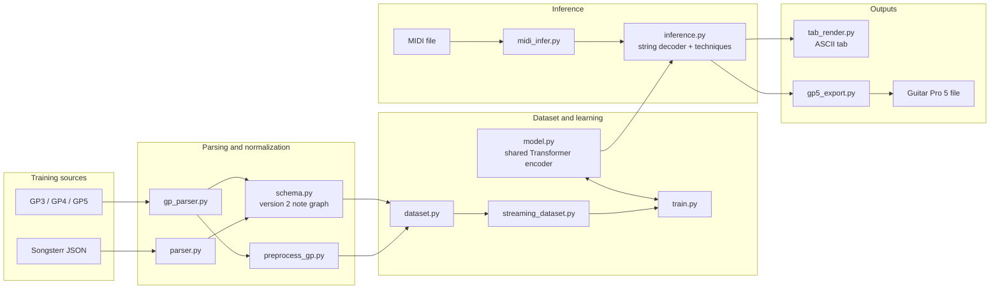

# midi2Frets architecture and file reference

Status snapshot: 2026-08-17 (multi-guitar architecture pass, two follow-up correction passes, a release-blocker pass, and a HARDENING pass -- §10.15 -- all uncommitted)
Schema: version 3 (additive multi-guitar envelope: `document_type: "multi_guitar_song"`, alongside the unchanged per-track `build_song_schema()` envelope; the hardening pass added optional `source_part_id`/`arrangement_role` note fields, purely additive, no version bump needed)
Architecture version: 5 (model.ARCHITECTURE_VERSION -- unchanged by the hardening pass, which touched no `nn.Module`)
Scope: the repository as it exists now, including this session's multi-guitar changes on top of the prior technique-model session (§§1-9 below describe that earlier, still-current single-guitar technique architecture; §10 describes the multi-guitar system, ending with §10.15's hardening pass -- read that subsection for what's current)

## 1. What the project currently does

`midi2Frets` converts symbolic music into playable six-string guitar tablature. It can learn string assignments from Songsterr/Guitar Pro examples, infer strings and frets for MIDI notes, predict a broad set of guitar techniques (including voice, a K-point bend curve, and beat-level pick direction/strum/tremolo-bar), render ASCII tab, and export Guitar Pro 5 files with real 2-voice allocation.

The current system is a technique-aware prototype, not yet a complete MIDI-to-Songsterr transcription system. Its strongest implemented path is:

```text
Guitar Pro/Songsterr data -> canonical notes (full timeline+tracks) -> Transformer training
MIDI notes -> evidence extraction -> Transformer string/technique/pointer predictions -> GP5 (2-voice)/ASCII tab
```

The distinction that matters most is:

- The schema can represent note-to-note transitions, note effects, harmonics, K-point bend curves, beat effects, voices, and full tempo/time-signature maps -- and every parser (Songsterr, Guitar Pro, MIDI) now actually populates the song-level `timeline`/`tracks`/`performance_events` envelope, not just individual notes.
- The neural model predicts strings, chord labels, transitions (via a learned candidate-pointer source, not a hand-written heuristic), note effects, harmonic type, bend type, a normalized bend curve, voice, and beat-level pick direction/strum/tremolo-bar presence.
- The MIDI importer preserves the full tempo/time-signature map, pitch-bend and control-change evidence (via `mido`, since PrettyMIDI's `Instrument` abstraction discards MIDI channel identity), and per-track provenance -- kept as EVIDENCE (`performance_events`), never promoted to a ground-truth technique label.
- The GP5 exporter allocates real Guitar Pro voices 0 and 1 (not voice 0 only) and receives the full tempo/time-signature event lists from the MIDI inference path when the source tempo map was trustworthy.

Therefore, the presence of a technique field or output head does not mean an old checkpoint already knows that technique. A checkpoint must have been retrained with supervised technique labels, and its `trained_heads` metadata (now accompanied by `architecture_version`/`model_config`/`vocab_sizes` -- see §4) must mark the relevant head as trained.

**This pass changed the architecture, not the weights.** No preprocessing was run, no training was run, and no checkpoint file was touched -- see §7's "Session changes" for exactly what was fixed vs. what is new-but-still-requires-retraining vs. what remains a known gap.

## 2. Current system architecture



### Training flow

1. `parser.py` reads Songsterr-style JSON, or `gp_parser.py` reads Guitar Pro files through PyGuitarPro.
2. The parser creates one canonical note per musical attack, extends tied notes, normalizes effects, and derives transition edges between note IDs.
3. `preprocess_gp.py` writes one JSON file per usable six-string guitar track.
4. `dataset.py` converts note windows into categorical input features, string/fret targets, and masked technique targets.
5. `streaming_dataset.py` discovers songs, creates a cached chunk index, and performs a deterministic song-level train/validation split.
6. `train.py` trains the shared Transformer and all enabled output heads. It saves both model weights and metadata describing which heads received supervision.

### MIDI inference flow

1. `midi_infer.py` opens a MIDI file with `pretty_midi` and chooses the densest non-drum, guitar-like instrument. It also now extracts EVIDENCE from the raw file before any note-cleanup decisions: `extract_tempo_events`/`extract_time_signature_events` (the full authored map, not one representative value), `extract_track_evidence` (every non-empty instrument's name/program/note-count/channels, via a `mido`-based per-(pitch,tick) channel lookup since PrettyMIDI's `Instrument` grouping discards the original MIDI channel), and `extract_performance_events` (pitch-bend/control-change events for the selected instrument). All of this rides alongside the existing single `tempo`/`time_signature` fields in `midi_to_notes()`'s returned `meta` dict -- additive, not a replacement, so every existing caller (`(notes, meta, stats) = midi_to_notes(...)`) is unaffected.
2. It converts seconds to ticks, filters very short or duplicate notes, limits polyphony, and creates unlabelled note records.
3. `inference.py` decodes string assignments using greedy, sampling, or beam search (beam search now also enforces string-occupancy, §5). Frets are then determined from pitch, tuning, and capo.
4. The technique decoder (`predict_techniques`) runs the transition-source POINTER (a learned prediction, §4/§5) to find the incoming edge's source, then the transition-type, per-note effect, harmonic, bend-curve, voice, and beat heads.
5. `tab_render.py` produces text tab. `gp5_export.py` adapts predictions to canonical notes and writes a `.gp5` file with real 2-voice allocation (§5).

## 3. Canonical data representation

`src/schema.py` defines schema version 2 as a note graph. Notes are nodes. Hammer-ons, pull-offs, slides, and ties are directed edges stored on the destination note.

A representative note looks like this:

```json
{
  "id": 42,
  "time": 3840,
  "dur_ticks": 480,
  "pitch": 67,
  "velocity": 96,
  "channel": 0,
  "track": 0,
  "measure": 1,
  "voice": 0,
  "string": 1,
  "fret": 8,
  "tuning": [64, 59, 55, 50, 45, 40],
  "capo": 0,
  "incoming_transition": {
    "type": "HAMMER_ON",
    "source_note_id": 41
  },
  "effects": {
    "palm_mute": false,
    "let_ring": true,
    "vibrato": false,
    "wide_vibrato": false,
    "staccato": false,
    "accent": false,
    "heavy_accent": false,
    "ghost": false,
    "dead": false,
    "tremolo_picking": false,
    "trill": false,
    "grace": false,
    "left_hand_tap": false
  },
  "harmonic": {
    "type": "NONE",
    "fret": null
  },
  "bend": {
    "type": "BEND_RELEASE",
    "points": [
      {"position_frac": 0.0, "semitones": 0.0},
      {"position_frac": 0.5, "semitones": 2.0},
      {"position_frac": 1.0, "semitones": 0.0}
    ]
  },
  "label_masks": {
    "string": true,
    "voice": true,
    "effects": true,
    "harmonic": true,
    "bend": true,
    "transition": true
  }
}
```

`label_masks` are essential. `false` means that the source did not provide a trustworthy label; it does not mean the technique was confirmed absent. This prevents legacy or MIDI notes from becoming false “no technique” training examples.

### Frozen vocabularies

The vocabularies are ordered and append-only because their indexes are checkpoint-facing class IDs.

| Target | Values currently represented |
|---|---|
| Incoming transition | `NONE`, `PICKED`, `HAMMER_ON`, `PULL_OFF`, `LEGATO_SLIDE`, `SHIFT_SLIDE`, four slide-in/out forms, `TIE`, `TAP` |
| Note effects | Palm mute, let ring, narrow/wide vibrato, staccato, accent/heavy accent, ghost, dead, tremolo picking, trill, grace, left-hand tap |
| Harmonic | None, natural, artificial, tapped, pinch, semi, feedback |
| Bend type | None, bend, bend-release, bend-release-bend, prebend, prebend-release, dip, dive, release up/down, return, custom |
| Beat effect | Pick direction plus parser-preserved beat-level data such as strum or tremolo-bar information |

### Song-level envelope

`build_song_schema()` wraps the notes in the full canonical document:

```json
{
  "schema_version": 2,
  "metadata": {},
  "timeline": {
    "ticks_per_quarter": 960,
    "tempo_events": [{"time_ticks": 0, "bpm": 120.0}],
    "time_signature_events": [{"time_ticks": 0, "numerator": 4, "denominator": 4}],
    "key_signature_events": [],
    "swing_feel": null,
    "pickup_ticks": 0
  },
  "tracks": [],
  "notes": [],
  "beat_effects": [],
  "performance_events": []
}
```

**This envelope is now the single end-to-end storage contract**, not aspirational:

- `parse_songsterr()` extracts the real tempo automation (`automations.tempo`, multiple entries per song, not just a header BPM) and every time-signature change from the raw score into `timeline`; `parse_guitarpro_tracks()` extracts the same from Guitar Pro's beat-level `MixTableChange` events and per-measure `TimeSignature`/`KeySignature`. Both return `{"notes", "metadata", "beat_effects", "timeline"}` -- additive to the pre-existing return shape, so every caller that only read `result["notes"]`/`result["metadata"]` is unaffected.
- `preprocess_gp.py` writes the FULL `build_song_schema()` envelope per track (`schema_version`, `timeline`, `tracks`, `beat_effects`, `metadata`, `notes`) -- it no longer silently drops `beat_effects` (a real bug: the old writer extracted them via `parse_guitarpro_tracks()` and then never included them in the JSON it wrote).
- `parser.py`'s fast path for preprocessed JSONs checks `"schema_version" in data` first (full envelope, no migration needed) and falls back to the legacy `"_notes"`-only format (migrated via `schema.migrate_flat_notes` when notes lack technique fields) -- old cached JSON keeps loading correctly.
- **Cache/index staleness detection**: `preprocess_gp.py`'s resume logic samples one existing output file's `schema_version` and warns loudly if it doesn't match the current code's `S.SCHEMA_VERSION`, instead of silently trusting a stale ledger. `streaming_dataset.py`'s chunk-index cache (`data/processed/chunk_index.json`) now stamps `schema_version` too and discards the WHOLE cache (not just per-file, since a parser/schema change can shift chunk boundaries without touching any source file's mtime) on a version mismatch.
- **Migration boundary**: `schema.migrate_flat_notes` is no longer dead code -- it is the actual code path that runs when a pre-schema `_notes` cache (no `"effects"` key on its first note) is loaded, backfilling `label_masks=False` (unknown, not a false negative) for every technique field.

## 4. Neural model

### Inputs

Every token is one note. `dataset.py` currently creates these eight categorical features:

| Feature | Meaning |
|---|---|
| `pitch` | MIDI pitch |
| `duration_bucket` | Quantized note duration |
| `delta_bucket` | Quantized time since the previous event |
| `beat_position` | Position inside the beat |
| `bar_position` | Position inside the measure |
| `chord_size` | Number of simultaneous notes |
| `chord_index` | Note position inside a simultaneous chord |
| `capo_bucket` | Capo fret |

The embeddings are summed and receive sinusoidal positional encoding. Velocity is stored by parsers and MIDI import but is not yet an input feature (still a documented gap -- see §7). Channel, controller values, pitch bends, and tuning identity are now EXTRACTED and preserved as evidence (`performance_events`, MIDI track provenance) but likewise not yet wired in as model input features -- adding them is a training-time change, out of scope for an architecture-only pass with no retraining.

### Shared encoder

- Model width: 256
- Attention heads: 8
- Transformer layers: 4
- Feed-forward width: 1024
- Architecture: pre-layer-normalized Transformer encoder
- Default dropout: 0.1
- Supported output strings: 6
- Parameter count: ~4.03M (was ~3.6M before this session's new heads)

### Output heads

| Head | Form | Current output |
|---|---|---|
| String | Per-note categorical | One of six guitar strings |
| Chord root | Per-note categorical | Fixed chord-root vocabulary |
| Chord quality | Per-note categorical | Fixed chord-quality vocabulary |
| Transition (type) | Note-pair categorical | Picked, hammer, pull, slide, tie, tap, etc. |
| Effects | Per-note multi-label | Thirteen independent binary effects |
| Harmonic | Per-note categorical | Seven harmonic classes |
| Bend type | Per-note categorical | Twelve bend types |
| Bend magnitude | Per-note regression | One maximum (derived) semitone value |
| **Bend curve** | Per-note, K=4 points | `bend_curve_pos`/`_semitone`/`_presence`, a fixed-size normalized curve (`schema.BEND_CURVE_K`) -- position/semitones/presence per point, not just a scalar |
| **Voice** | Per-note categorical | Which of Guitar Pro's 2 voices (`schema.NUM_VOICES`) |
| **Transition source pointer** | Candidate-scoring, `schema.TRANSITION_LOOKBACK`=8 + 1 | Scores the previous 8 tokens plus an explicit "no source" slot; replaces the old inference-time same-string heuristic (see below) |
| **Beat pick direction** | Pooled-beat categorical | `schema.PICK_DIRECTIONS` (none/up/down), pooled over every note sharing a beat (`chord_index==0` grouping) and broadcast back |
| **Beat effect** | Pooled-beat multi-label | `schema.BEAT_EFFECT_FLAGS` (has_strum, has_tremolo_bar presence only -- not a curve) |

Bold rows are new this session. The transition TYPE head is still the note-pair classifier described before (concat of destination state, source state, their difference, pitch interval, timing gap); during training it is teacher-forced from the labelled `source_note_id`. **The transition SOURCE is now a real prediction, not an inference-time approximation**: the pointer scores every token in a `TRANSITION_LOOKBACK`-sized causal window (plus a learned "no source" candidate) using the same pair-feature recipe, trained with its own masked cross-entropy against which candidate slot the true source actually falls in (three-way target: real in-window source / genuinely no source / source exists but out-of-window -- the third case is `-100`, unlabeled, not collapsed into "no source", so the pointer is never taught a false negative). At inference, `predict_techniques` runs the model twice per chunk when the pointer is trained: once to read its candidate scores, once more with the pointer's own argmax fed back in as the source offset, so the type classifier reasons about the SAME source the pointer picked. When the pointer is untrained (e.g. an older checkpoint), inference falls back to the pre-existing same-string-nearest-neighbor heuristic.

### Losses

`train.py` combines:

- masked string cross-entropy;
- a differentiable expected-fret playability loss;
- optional chord-root and chord-quality losses;
- masked transition-TYPE cross-entropy;
- masked multi-label effect binary cross-entropy;
- masked harmonic and bend-type cross-entropy;
- masked bend-magnitude mean squared error;
- a soft hammer-on/pull-off physical-consistency penalty;
- **masked voice cross-entropy** (`--voice-weight`);
- **masked bend-curve loss** (`--bend-curve-weight`): presence BCE over all K slots on every examined note, plus position/semitone MSE masked further by the presence TARGET (only backprops through slots a real point occupies);
- **masked transition-source pointer cross-entropy** (`--transition-source-weight`), separate from the type loss above;
- **masked beat loss** (`--beat-weight`): pick-direction cross-entropy + strum/tremolo-bar-presence BCE, gated on the same "was this note's beat actually examined" condition as the note-effects mask (beat effects are extracted in the same parse pass).

Every technique loss weight is now exposed and forwarded through `run.py train` (previously only reachable by calling `train.py` directly) -- `run.py`'s own `--*-weight` CLI flags default to the same values as `train.py`'s and `config.yaml`'s documented reference.

### Checkpoint compatibility

New heads are additive. `load_compatible_state_dict()` can load older string-only checkpoints with `strict=False`, leaving missing heads freshly initialized. `trained_heads` metadata is the safety gate that prevents random technique weights from producing seemingly valid notation.

**Checkpoint metadata is now more than `trained_heads`.** Every save (`model.checkpoint_metadata()`) also records `architecture_version` (bumped to 3 this session), `schema_version`, `feature_spec_version` (`dataset.FEATURE_SPEC_VERSION`, unchanged this session), `model_config` (d_model/nhead/num_layers/dim_feedforward/dropout/num_strings, read off the actual model instance), and `vocab_sizes` (every checkpoint-facing class count). `model.check_architecture_compatibility()` compares a loaded checkpoint's metadata against the current code before `load_state_dict` and warns (not raises -- a genuine shape conflict still fails there with its own error) with a specific field-level diff instead of a bare tensor-shape traceback; it is called from `midi_infer.py::load_model`, `evaluate.py`, and `train.py`'s `--resume` path. Checkpoints predating this metadata (no `model_config`/`vocab_sizes` keys) compare as clean (nothing to compare against), so old files still load without spurious warnings.

The checkpoints currently present under `checkpoints/` predate the new default `checkpoints/model_gp.pt` name AND this session's new heads entirely. Their existence alone is not proof that any technique head was supervised. Retraining schema-v2 examples is required before technique inference can be trusted -- this session did not run that retrain (see the status note at the top).

## 5. Decoding and export

### String/fret decoding

`inference.py` supports:

- greedy decoding;
- stochastic sampling;
- beam search with penalties for hand movement and simultaneous-note string reuse, **now also enforcing string-occupancy** (`inference.string_free_at`): a string still ringing from an earlier note (its end tick is past a new note's onset) cannot be re-attacked by that new note, with the same physical-impossibility fallback pattern used everywhere else in this codebase (degrade gracefully rather than crash if every candidate is somehow occupied). Deliberately scoped to beam search only, per the "keep greedy as the simple baseline, put improved constraints in the structured/beam decoder" design choice -- greedy and sampling are unchanged.

Physical pitch/string validity is enforced with `constraints.py`. The beam state models per-string occupancy (new) but still does not model a full hand shape, finger occupancy, or barre state.

### Technique decoding

Technique predictions run after string prediction. This makes transitions dependent on the first-stage string decision. Edge techniques receive hard checks such as same-string source/destination and pitch direction for hammer-ons versus pull-offs. Low-confidence categorical predictions fall back to neutral values. Effect thresholds are currently fixed at 0.5.

The transition SOURCE itself (§4) is now the learned pointer's own prediction when trained, not a same-string heuristic -- `predict_techniques` reads `transition_source_scores`, takes the causally-masked argmax (a real candidate offset or the explicit "no source" slot), and re-runs the model with that offset so the type classifier and the source pointer agree with each other. `predict_techniques`' output also now includes `voice` (confidence-gated categorical), `bend_curve` (a real point list reconstructed from the K-point heads when `bend_curve` is trained, falling back to the old 2-point scalar synthesis otherwise so a real bend is never left unexported), and `beat_pick_direction`/`beat_effect` (confidence-gated, per note, inherited from that note's beat). Every new output follows the same untrained-head-is-neutral contract as before: a head not marked trained in `trained_heads` returns `None`, never a random-weight guess. A regression test (`test_predict_techniques_reaches_real_decode_with_only_a_newer_head_trained`) covers a bug this session found and fixed: the early "all heads untrained" short-circuit only checked the original 4 heads, so a checkpoint with e.g. only `voice` trained incorrectly hit the neutral-dict early exit.

### GP5 export

`gp5_export.py` uses a per-string event sweep so notes with different durations can be split and tied across rhythmic segments. It writes note effects, transitions, bends (full K-point curves -- the exporter already wrote however many points `bend["points"]` contained, so no change was needed there), harmonics, time signatures, and tempo changes when those canonical values are provided.

**Voice allocation is now real** (`gp5_export._sweep_voice`): notes are partitioned by their canonical `voice` field and the per-string event sweep runs independently per voice, writing into `track.measures[m].voices[0]` and `voices[1]` -- Guitar Pro's own hard 2-voice limit. A note with `voice >= 2` (the schema allows arbitrary ints; GP5 does not) is folded into voice 1 with one summary warning, not silently coerced. Every existing single-voice caller (the entire pre-this-session test suite, and every current real usage since nothing predicts `voice` yet without a retrain) produces byte-identical output, since a note set containing only voice 0 collapses to exactly the old single-voice sweep -- this is a strict superset, verified by the full pre-existing round-trip suite still passing unchanged.

**Overlapping notes on the same string are no longer silently overwritten.** When two different notes in the same voice claim the same string at the same segment (should not occur from a correct decoder, but was previously a silent dict-overwrite with no trace), the exporter now appends a structured warning identifying both note ids before keeping one -- `strict_export` can turn this into a hard failure like every other warning.

The MIDI path (`midi_infer.py::main`) now passes the FULL tempo/time-signature event lists through to the exporter when the source tempo map was trustworthy (`tempo_source == "midi"`); when the map was estimated from onsets or explicitly overridden (`--tempo`), it still collapses to one corrected event rather than reintroducing an untrustworthy multi-event map.

**Known, still-open gap**: beat-level predictions (pick direction, strum/tremolo-bar presence) are fully modeled, trained-loss-supervised, and reconstructed at inference time (§4), but `gp5_export.py` does not yet write them into the `.gp5` beat objects -- the prediction pipeline is complete, only the final "attach to a GP `BeatEffect`" hop is unbuilt. Scoped out of this pass as lower-priority than voice allocation; see §7.

## 6. File-by-file reference

### Repository root

| File | Responsibility | Notes |
|---|---|---|
| `.gitignore` | Excludes generated/local files from Git. | Repository hygiene only. |
| `README.md` | Main project overview, setup, commands, and design narrative. | Broad user-facing guide; this document is the code-oriented architecture snapshot. |
| `LICENSE` | Project license. | MIT license. |
| `requirements.txt` | Python dependencies. | Includes PyTorch, NumPy, PyGuitarPro, PrettyMIDI, `mido` (added this session -- MIDI channel evidence PrettyMIDI's `Instrument` abstraction discards), and pytest. |
| `config.yaml` | Human-readable experiment defaults. | Documentation/config reference; the runtime scripts do not load it. |
| `run.py` | Main orchestration CLI. | Runs preprocessing, manifest generation, overfit checks, training, or the combined pipeline as subprocesses. |
| `train.ps1` | Windows training launcher. | Convenience wrapper; verify its arguments when changing the Python CLI. |
| `colab_train.ipynb` | Google Colab training notebook. | A separate entry point that can drift from current CLI/model behavior. |
| `index.html` | Static project presentation page. | Not part of model execution and may lag behind the technique architecture. |

### Source modules

| File | Responsibility | Architectural role |
|---|---|---|
| `src/schema.py` | Schema-v2 vocabularies, note/song builders, migration, validation, IDs, transition derivation, physical checks, beat-label attachment. | Canonical contract for technique-aware data; also declares `NUM_VOICES`, `BEND_CURVE_K`, `TRANSITION_LOOKBACK`, `BEAT_EFFECT_FLAGS`. |
| `src/parser.py` | Songsterr JSON parser. | Normalizes notes, ties, transitions, bends, harmonics, note effects, beat effects, velocity, diagnostics, and the full tempo/time-signature `timeline`. |
| `src/gp_parser.py` | Guitar Pro parser using PyGuitarPro. | Produces one canonical result per six-string guitar track, including its `timeline` (tempo/time-sig/key-sig events). |
| `src/preprocess_gp.py` | Parallel GP corpus preprocessor. | Writes the FULL canonical schema-v2 envelope per track (not just `_notes`) and maintains a resume ledger with schema-version staleness detection. |
| `src/build_manifest.py` | Dataset manifest builder. | Scans JSON files and records fast training/discovery metadata. |
| `src/dataset.py` | Feature encoding, labels, masks, augmentation, chunking, and collation. | Converts canonical notes into model tensors; targets now include voice/bend-curve/transition-source-candidate/beat. Declares `FEATURE_SPEC_VERSION`. |
| `src/streaming_dataset.py` | Streaming corpus dataset and song-level splitting. | Avoids loading the full corpus; chunk-index cache now schema-version-stamped and invalidated on mismatch. |
| `src/chords.py` | Rule-based chord detection and fixed chord vocabularies. | Supplies auxiliary chord labels and display names. |
| `src/constraints.py` | Pitch-to-string/fret physical masks. | Prevents impossible string assignments. |
| `src/model.py` | Shared Transformer and output heads. | Defines forward inference, compatible checkpoint loading, and checkpoint metadata (`checkpoint_metadata`/`check_architecture_compatibility`/`ARCHITECTURE_VERSION`). |
| `src/train.py` | Primary trainer. | Computes string/chord/technique losses (now including voice/bend-curve/transition-source/beat), validation metrics, logging, early stopping, and checkpoints with full §6 metadata. |
| `src/train_all.py` | Legacy/in-memory multi-song launcher. | Alternative to the streaming path; not the primary orchestrated route; does not forward the newer technique loss weights. |
| `src/inference.py` | Greedy, sample, beam, and technique decoding. | Converts logits into physically filtered predictions; beam search enforces string occupancy; technique decoding uses the learned transition-source pointer. |
| `src/midi_infer.py` | End-to-end MIDI inference CLI. | Imports MIDI, extracts full tempo/track/performance-event evidence, prepares notes, invokes decoders, renders tab, and exports GP5 with the full tempo/time-sig map. |
| `src/gp5_export.py` | Canonical-note/prediction to GP5 exporter. | Performs rhythmic segmentation per VOICE (0 and 1) and writes supported notation effects; reports (never silently drops) overlapping same-string notes. |
| `src/gp5_roundtrip.py` | Temporary export-and-reparse helper. | Used to test whether written GP5 semantics survive parsing; also reused by `metrics.export_reparse_preservation_rate`. |
| `src/tab_render.py` | ASCII tablature and comparison rendering. | Displays fret numbers, technique connectors/glyphs, and chord labels. |
| `src/dp_baseline.py` | Classical dynamic-programming string assignment. | Non-neural baseline for evaluation. |
| `src/metrics.py` | String/playability + technique metrics. | Accuracy, hand shifts, repeated-pitch switches (bug-fixed this session), open-string usage, playable-fret rate, and masked transition/effects/harmonic/bend/voice/beat/export-reparse metrics. |
| `src/evaluate.py` | Checkpoint versus ground truth/baseline CLI. | Evaluates string assignment AND (when any technique head is trained) technique quality via `metrics.py`'s new functions. |
| `src/fetch_songsterr.py` | Songsterr data discovery/downloading helper. | Corpus acquisition utility. |
| `src/extract_har.py` | Extracts Songsterr track JSON from HAR captures. | Offline dataset acquisition utility. |
| `src/multi_guitar.py` | **(§10)** Structured CSP + temporal beam-search multi-guitar decoder. | Non-neural: `decode_song`/`auto_select_guitar_count` partition notes across the minimum feasible guitar count under hard physical constraints (§10.15: now also arrangement-mode-aware, tempo-aware, sustain-policy-aware, dominance-pruned). |
| `src/notation_quantizer.py` | **(§10)** Timeline-aware notation quantization. | Fills `notation_onset_tick`/`notation_duration_tick`/measure/beat fields from raw performance timing; §10.15 added `ticks_to_seconds` for tempo-aware scoring. |
| `src/fingering.py` | **(§10.15, new)** Deterministic left-hand fingering/chord-shape CSP. | `assign_fingering`/`event_is_fingerable`: exact 4-finger(+barre) feasibility check, cached by normalized chord shape -- see §10.15.3. |

See §10 for the full multi-guitar architecture description (schema/constraints/midi_infer/gp5_export/model/train/dataset/preprocess_gp/metrics/evaluate were all EXTENDED, not replaced, for multi-guitar support -- §10.8 lists exactly what changed in each).

### Tests

384 tests across 30 files (337 across 27 files before the hardening pass, §10.15; 159 across 15 files before the first multi-guitar pass; see §10.8-§10.13 for the multi-guitar test files, including `tests/test_multi_guitar_correction.py` (first correction pass), `tests/test_multi_guitar_correction_2.py` (second correction pass), and `tests/test_multi_guitar_release_blocker.py` (third, release-blocker pass); §10.15 added `tests/test_fingering.py`, `tests/test_multi_guitar_hardening.py`, and `tests/test_metrics_hardening.py`).

| File | Coverage |
|---|---|
| `tests/conftest.py` | Test import/path setup and shared fixtures. |
| `tests/test_schema.py` | Schema defaults, migration, transitions, masks, and validation. |
| `tests/test_parser_songsterr.py` | Songsterr effects/transition parsing, tied-beat timing regressions, timeline (tempo/time-sig) extraction. |
| `tests/test_gp_parser.py` | Guitar Pro parsing, normalized techniques, tied-beat timing regressions, timeline extraction. |
| `tests/test_preprocess_gp.py` | Full canonical envelope written and round-tripped through `parser.py`; stale schema_version rejected. |
| `tests/test_streaming_dataset_cache.py` | Chunk-index cache records/enforces `schema_version`. |
| `tests/test_metrics.py` | `unnecessary_string_switches` chord-guard bug fix. |
| `tests/test_metrics_technique.py` | Masked technique metrics (transition/effects/harmonic/bend/voice/beat/export-reparse). |
| `tests/test_dataset_technique.py` | Technique tensor labels, masks, source offsets, augmentation, voice/bend-curve/transition-source-candidate targets. |
| `tests/test_model.py` | Model tensor shapes, compatibility behavior, new-head shapes, beat pooling, transition-source-pointer masking, checkpoint metadata. |
| `tests/test_train_technique_losses.py` | Masked technique losses (including the 4 new heads) and physical penalties. |
| `tests/test_inference_technique.py` | Technique decoding, confidence fallbacks, physical checks, transition-source-pointer integration, bend-curve reconstruction, beat output. |
| `tests/test_inference_decoding.py` | String-occupancy state and its effect on beam search. |
| `tests/test_gp5_roundtrip.py` | Export/reparse preservation for supported GP5 semantics, multi-voice export, overlap-warning behavior. |
| `tests/test_tab_render.py` | Technique glyph and alignment rendering. |
| `tests/test_midi_evidence.py` | Full tempo/time-signature extraction, track provenance, pitch-bend/CC evidence from MIDI. |
| `tests/test_end_to_end.py` | Cross-module technique pipeline behavior. |

### Data, models, and generated artifacts

| Path | Current purpose |
|---|---|
| `data/raw/` | Raw/hand-provided JSON inputs. |
| `data/ScoreSetDataSet/` | Large Guitar Pro source corpus. At this snapshot it contains about 15.5k files. |
| `data/processed/` | Generated GP JSON, manifests, chunk indexes, and preprocessing ledgers/logs. |
| `checkpoints/` | Saved model and resume-state files. Current root files are `model.pt`, `model_overfit.pt`, and `model_overfit.pt.resume`. |
| `checkpoints/logs/` | Human-readable and JSONL training logs. |
| `examples/demo_tab.json` | Example prediction data. |
| `examples/demo_tab.txt` | Example rendered tablature. |
| `examples/demo_tab.gp5` | Example Guitar Pro export. |
| `.claude/` | Local Claude settings and scheduling state, not application architecture. |
| `.pytest_cache/`, `__pycache__/` | Generated test/interpreter caches. |

## 7. Architecture audit findings

These are findings from reading the current implementation. They are not fixed by this documentation-only change.

### High priority correctness issues -- FIXED this session

1. **Tied beats advance time twice in both parsers -- FIXED.** The matched-tie branch's redundant inner `voice_time += ticks` was removed from both `src/parser.py` and `src/gp_parser.py`; `voice_time` now advances exactly once per beat, after the note loop, regardless of how many notes in that beat are tie continuations. Regression tests: one tie across beats, a tie sharing a beat with an ordinary note, several consecutive ties, multiple voices with ties (both parsers).
2. **The processed format drops part of schema v2 -- FIXED.** `src/preprocess_gp.py` now writes the full `schema.build_song_schema()` envelope (`schema_version`, `timeline`, `tracks`, `beat_effects`, `metadata`, `notes`) per track. The `beat_effects`-dropping bug (it was extracted by the parser and then never included in the written JSON) is fixed as part of the same change.
3. **The repeated-pitch switch metric has a faulty chord guard -- FIXED.** `src/metrics.py`'s `unnecessary_string_switches` now tracks `prev_time` separately and compares onset-to-onset, not onset-to-pitch.

### Capability gaps relative to Songsterr-quality output -- status this session

1. **MIDI performance data is discarded -- ADDRESSED (evidence, not yet model input).** Pitch-bend/control-change events, full tempo/time-signature maps, and per-track/channel provenance (via `mido`, since PrettyMIDI's `Instrument` grouping drops the original channel) are now extracted into `performance_events`/`timeline`/`tracks` and preserved through `midi_to_notes()`. They are NOT yet wired into the model as input features -- that is a training-time change requiring a retrain, explicitly out of scope for this pass. Velocity is likewise still not a model input feature.
2. **BPM is reduced to one value -- FIXED for trustworthy tempo maps.** The full tempo/time-signature event lists now flow through every parser and into GP5 export (`midi_infer.py::main` passes them when `tempo_source == "midi"`); the single-representative-BPM path is kept ONLY for the case where the source map is itself untrustworthy (estimated from onsets, or explicitly overridden) and would corrupt the export if passed through as multiple events.
3. **No learned voice separation -- BUILT, untrained.** `schema.NUM_VOICES`, a `voice_head`, masked dataset targets, a masked training loss, confidence-gated inference reconstruction, and real 2-voice GP5 export allocation all exist now. No checkpoint has been trained with this head yet.
4. **Bends are lossy -- BUILT, untrained.** A real `schema.BEND_CURVE_K`-point curve (position/semitones/presence per point) replaces scalar-only reconstruction end to end: dataset targets, three model heads, a masked loss, inference reconstruction (falling back to the old 2-point synthesis only when the curve head isn't trained), and export (already point-list-based, needed no change). No checkpoint has been trained with this head yet.
5. **Beat techniques are not learned -- MOSTLY BUILT.** `schema.attach_beat_labels` attaches parsed beat_effects to notes; dataset targets, pooled model heads (mean-pooled over `chord_index==0` beat groups, broadcast back), a masked loss, and confidence-gated inference reconstruction exist for pick direction and strum/tremolo-bar PRESENCE (not a tremolo-bar curve shape, which was never predicted -- only its presence). **Still missing**: `gp5_export.py` does not yet write these predictions into the `.gp5` beat objects (the prediction pipeline is complete; only the final export hop is unbuilt).
6. **Technique evaluation is incomplete -- FIXED.** `metrics.py` gained masked transition (type P/R/F1 + source accuracy + physical-validity rate), effects (per-effect + macro/micro F1), harmonic, bend (type + curve MAE), voice, and beat-effect metrics, plus an export/reparse semantic-preservation check reusing `gp5_roundtrip.py`. `evaluate.py`'s CLI reports all of them (gated on any technique head being trained, so an all-untrained checkpoint doesn't produce vacuous numbers).
7. **Inference is staged, not jointly structured -- PARTIALLY ADDRESSED.** Strings are still decoded first, but the transition SOURCE is now a genuine learned pointer prediction (not a same-string heuristic) reconciled with the type classifier via a second forward pass. Beam search now tracks per-string occupancy (a note cannot re-attack a string still ringing from an earlier note). Still not addressed: a fully joint single-pass decoder, hand-position/finger-shape state, and multi-voice-aware beam search (voice allocation is a POST-hoc property of `note["voice"]`, not something the decoder currently chooses jointly with string/fret).
8. **Six-string-only validation -- unchanged.** Still explicitly rejected by `schema.validate_song`, not addressed this session (not requested).
9. **Configuration is split -- FIXED.** Every technique/chord loss weight `train.py` accepts is now exposed and forwarded through `run.py train`. `train.py`'s own `--save` default now matches `run.py`/`evaluate.py`/`midi_infer.py` (`checkpoints/model_gp.pt`), closing the checkpoint-name mismatch. `config.yaml` remains documentation-only by design (its header already said so accurately) -- not "pretending" to be loaded.
10. **Existing generated data and checkpoints may be stale -- detection ADDED.** `preprocess_gp.py`'s resume logic and `streaming_dataset.py`'s chunk-index cache both now check `schema_version` and warn/invalidate on mismatch instead of silently reusing stale results. The corpus still has not been regenerated and no checkpoint has been retrained this session (explicitly out of scope -- see the status note at the top).

## 8. What remains open after this session (single-guitar/technique scope, §§1-7)

1. **No training was run.** Every new head (voice, bend_curve, transition_source, beat) and every corrected parser/schema/export behavior is architecturally complete and unit-tested, but `checkpoints/model.pt` predates all of it. `trained_heads`/`architecture_version`/`model_config` on that checkpoint correctly report this -- inference stays honest (neutral output) rather than fabricating predictions.
2. **The corpus has not been regenerated.** `data/processed/gp_json/` is still empty; `preprocess --fresh` was intentionally not run (heavy, long-running, explicitly out of scope for an architecture-only pass).
3. **Beat-effect GP5 export** (pick direction, strum/tremolo-bar presence) is the one piece of the "beat techniques" capability gap left unbuilt -- see item 5 above.
4. **Model input features are unchanged**: velocity, exact onset/duration, track/channel identity, and the newly-extracted MIDI performance evidence are all available in the canonical document now but not yet embedded as Transformer inputs. Doing so is a training-time architecture change that would need to be validated by an actual training run, which this pass could not do.
5. **Six/seven/eight-string and non-standard-tuning support** remains out of scope, as before.
6. **A fully joint decoder** (single pass reasoning about string, voice, transition source, and technique together, with hand-position/finger-shape state) remains future work; this session added real but incremental structure (string occupancy, a learned transition-source pointer) to the existing staged greedy/beam/technique pipeline rather than replacing its two-stage design.

## 9. Verification and common commands

The repository test suite passes at this snapshot:

```text
337 passed in ~113s (159 single-guitar/technique + 178 multi-guitar across §10's four passes)
```

Useful commands from the repository root:

```powershell
# Run all tests
pytest -q

# Preprocess Guitar Pro files, then build the manifest
python run.py preprocess
python run.py manifest

# Sanity-check training on a tiny example
python run.py overfit

# Train the streaming corpus
python run.py train

# Run MIDI inference and export GP5
python src/midi_infer.py input.mid --checkpoint checkpoints/model_gp.pt --gp5-out output.gp5

# Force BPM when an audio-to-MIDI file has an unreliable/default tempo map
python src/midi_infer.py input.mid --tempo 120 --checkpoint checkpoints/model_gp.pt --gp5-out output.gp5

# Evaluate string assignment AND (once a checkpoint has trained technique
# heads) technique quality against the DP baseline
python src/evaluate.py --data data/raw/file.json --checkpoint checkpoints/model_gp.pt
```

Passing tests confirms the behavior currently covered by the suite. Python must be invoked by full path in this environment -- `python`/`py` alone resolve to the Windows Store stub, not a real interpreter; this session used `& "C:\Users\<you>\appdata\local\python\pythoncore-3.14-64\python.exe" -m pytest tests/ -q`.

## 10. Multi-guitar architecture (§§10.1-10.8 describe the FIRST multi-guitar pass; §10.9 is a follow-up correction pass on top of it; §10.11 is a SECOND follow-up correction pass; §10.13 is a THIRD, small release-blocker pass on top of all of that -- read 10.13 for what's current)

### 10.1 What this adds

Everything in §§1-9 above is the SINGLE-guitar, technique-aware pipeline (one MIDI/GP track in, one set of string/fret/technique predictions out) and is unchanged. This session adds a SEPARATE, parallel capability: given an arbitrary MIDI file (potentially with more simultaneous notes than one guitar can physically play), partition its notes across the MINIMUM number of physically playable guitar tracks and export a real multi-track `.gp5`. The product goal is explicitly partition-not-drop: every input note must survive in the output, on some guitar, never merged, transposed, or silently capped.

This is NOT source separation or an "arrangement" feature -- it does not decide which instrument should play what musically. It is a structural constraint solver: given a fixed set of notes with fixed timing, find the smallest set of standard 6-string guitars (each with its own tuning/capo) on which every note can be legally fretted without any two simultaneous notes on the same guitar colliding on a string.

### 10.2 Pipeline

```text
MIDI file -> import_midi_notes() -> quantize_notes() -> auto_select_guitar_count()
    -> [decode_song() per K, CSP + beam search] -> new_guitar_note()/new_guitar_track()
    -> build_multi_guitar_song() -> export_multi_guitar_gp5() -> multi-track .gp5
```

`midi_infer.run_multi_guitar_pipeline()` wires the whole thing together end to end and is the single entry point most callers should use.

1. **Non-destructive MIDI import** (`midi_infer.import_midi_notes`): every note gets a permanent `source_note_id` and BOTH `performance_onset_tick`/`performance_offset_tick` (raw, unquantized) and later-filled `notation_onset_tick`/`notation_duration_tick`. Policies (`preserve_all_notes`, `unplayable_policy`, `short_note_policy`, `duplicate_note_policy`, `sustain_policy`) all default to non-destructive (`"preserve"`/`"report"`); a note is only ever dropped if a policy is EXPLICITLY set to do so.
2. **Notation quantization** (`notation_quantizer.quantize_notes`): fills in `notation_onset_tick`/`notation_duration_tick`/`measure_index`/`beat_position`/`event_id`/`quantization_confidence` against the song's real tempo/time-signature timeline (no hard-coded 4/4 assumption).
3. **Legal candidate generation** (`constraints.legal_candidates_for_pitch`): for a given pitch and a guitar's tuning/capo/fret_count, `fret = pitch - tuning[string] - capo` is computed DETERMINISTICALLY for every string; never predicted by a model. This is the hard physical ground truth the whole decoder is built on.
4. **Structured decoding** (`multi_guitar.decode_song`): notes sharing a notation onset are grouped into "events"; a most-constrained-first backtracking CSP search enumerates joint (guitar, string, fret) assignments per event subject to hard constraints (unique string per guitar per event, chord-span, sustain non-collision, source-note conservation), then a temporal beam search (`DecoderState` carrying per-string free-at ticks, hand position, and track coherence) chains events together, scoring soft costs (hand-position shift, chord stretch, string crossing, source-track coherence). Quality presets (`fast`/`balanced`/`best`) trade search breadth for speed.
5. **Auto guitar-count search** (`multi_guitar.auto_select_guitar_count`): `for K in range(min_guitars, max_guitars+1): result = decode(K); if result.feasible: return result` -- lexicographic: preserve every note first, then the fewest guitars that make decoding feasible, then lowest soft cost. There is no neural "how many guitars" prediction in this loop; a `slot_active_logits`/`count_logits` head exists in the model as an optional future HINT, but never overrides this search. **§10.9 item 11** wires a TRAINED candidate scorer's per-candidate logits into `decode_song`'s soft costs (via `note_scores`) when a checkpoint's `trained_heads["candidate_scorer"]` is true -- still never a hard-constraint override, and every checkpoint that exists today reports that head untrained, so this path is unexercised by any real checkpoint.
6. **Canonical output** (`schema.new_guitar_note`/`new_guitar_track`/`build_multi_guitar_song`): one `multi_guitar_song` document with `request`/`timeline`/`source_tracks`/`guitar_tracks`/`diagnostics`. `schema.validate_source_note_conservation` is the load-bearing invariant check: the union of every output note's `source_note_id` must equal the input set exactly.
7. **Multi-track GP5 export** (`gp5_export.export_multi_guitar_gp5`): one real Guitar Pro track per non-empty `guitar_slot`, reusing the proven single-guitar `_sweep_voice` per-string/per-voice sweep independently per guitar track; tempo/time-signature written once at the song level.

### 10.3 Why this is a classical solver, not a neural model

**The decoder that actually runs today (`multi_guitar.py`) is 100% non-neural** -- deterministic fret computation plus CSP/beam search over heuristic costs (hand-position weight, chord-stretch weight, string-crossing weight, etc., all in `constraints.PlayabilityProfile`). This was a deliberate design choice, not a placeholder: "never use a neural model as a substitute for hard physical validation" means the system must be CORRECT (never drop/duplicate a note, never produce an illegal fret) with zero dependence on training. The classical solver satisfies every hard constraint by construction; a trained neural scorer, if ever wired in, could only ever influence which of several EQUALLY-legal solutions is preferred (a soft-cost input), never bypass a hard constraint.

### 10.4 Neural architecture (model-only, untrained scaffold)

**Superseded by §10.9 items 1/2/9/10** -- as first built, `forward_multi_guitar` scored candidates from note+slot+string+fret features ALONE, so two identically-configured guitars got byte-identical `candidate_logits`/`slot_active_logits` (no persistent per-slot identity, no song-level conditioning, no event-level context). §10.9 corrected this; the description immediately below is what shipped THIS pass, kept for history.

`model.py` (ARCHITECTURE_VERSION bumped 3 -> 4) adds `GuitarSlotEncoder` (a permutation-symmetric embedding of a guitar's tuning/capo/fret_count/program, so slot 0 and slot 1 are interchangeable, not ordinally meaningful) and `GuitarStringTransformer.forward_multi_guitar()`, which returns:

| Output | Shape | Meaning |
|---|---|---|
| `candidate_logits` / `candidate_mask` | `[B,T,K,S]` | Per-note, per-guitar-slot, per-string score/legality |
| `candidate_frets` | `[B,T,K,S]` | The deterministic fret for each (note,slot,string), for reference alongside the score |
| `assignment_confidence` | `[B,T,K]` | Confidence the note belongs on this slot at all |
| `voice_logits` | `[B,T,K,2]` | Which of 2 voices, per candidate slot |
| `slot_active_logits` | `[B,T,K]` | Optional hint for whether a slot is in use |

This head group (`HEAD_GROUPS["candidate_scorer"]`) exists architecturally and passes shape/gradient tests (`tests/test_model.py`), but **no checkpoint has ever been trained with it** -- `checkpoints/model.pt` predates this session and reports `trained_heads["candidate_scorer"] = False` (verified by `tests/test_model.py::test_legacy_checkpoint_loads_and_only_string_head_is_trained`, which now iterates every `HEAD_GROUPS` entry including this new one). Because the working decode path (§10.3) never calls this head, an untrained checkpoint has zero effect on correctness -- there is no code path where the untrained scorer's output reaches a final assignment.

**Training-side scaffolding also exists but has not been run**: `dataset.merge_tracks_to_midi_like`/`build_multi_guitar_targets` (strip string/fret identity from a grouped multi-track GP file, keep the originals as Hungarian-matchable targets), `train.py`'s permutation-invariant losses (`permutation_invariant_candidate_loss` using `scipy.optimize.linear_sum_assignment` so target-track labeling order never matters -- verified by a direct swap-invariance test), `matched_voice_loss`, `slot_active_loss`, `guitar_count_loss`, `multi_guitar_playability_loss`, `structure_ranking_loss`, and MIDI-style augmentation (`dataset.augment_midi_style`: onset/duration/velocity jitter, chord asynchrony, all-or-nothing transposition). `preprocess_gp.py --grouped` writes the one-JSON-per-song grouped format (`document_type: "grouped_multi_track_song"`) these losses need, into a SEPARATE output directory from the legacy per-track corpus. None of this was invoked this session -- no preprocessing, no training, per the explicit constraint this pass operated under.

### 10.5 Technique integration

`technique_mode` (in `schema.default_guitar_request`) defaults to `"off"` and nothing in the multi-guitar path currently reads it -- technique prediction (§§1-9) remains a fully separate, optional, downstream capability that could in principle run per-guitar-track after partitioning, but that wiring does not exist yet. `voice` is a first-class field on every `guitar_note` (default 0, always present, never omitted), and `export_multi_guitar_gp5` writes/round-trips it correctly with no gate on techniques being enabled. **The decoder assigning every note voice 0 was fixed in §10.9 item 12** (`multi_guitar.assign_voices`, a real independent post-decode voice-splitting stage, now wired into `run_multi_guitar_pipeline`) -- see there for the current behavior.

### 10.6 Evaluation

`metrics.py` gained a dedicated multi-guitar section (distinct from the single-guitar metrics in §1-9): `source_note_coverage`, `duplicate_output_rate`, `hard_constraint_violation_rate`, `chord_stretch_distribution`, `sustain_collision_rate`, `hand_movement_stats`, `guitar_utilization`, `track_fragmentation`, `permutation_invariant_assignment_metrics` (Hungarian-matches predicted `guitar_slot`s to target tracks by note-overlap before scoring assignment/string/voice accuracy, so slot-labeling order never affects the score), `guitar_count_accuracy`, and `multi_guitar_export_reparse_preservation` (real `.gp5` write + reparse, matched by `(onset, string)` since a GP5 file has no `source_note_id` field to recover on reparse). `evaluate.py --multi-guitar-midi <file.mid>` runs the full decoder pipeline on a real MIDI file and reports all of them -- no checkpoint is loaded for this path, since the working decoder needs none.

### 10.7 Known limitations (superseded in part by §10.9 -- see there for what's current)

1. ~~Voice is always 0 from the decoder.~~ **Fixed in §10.9 item 12**: `multi_guitar.assign_voices` is a real, independent post-decode stage now wired into the real pipeline.
2. ~~The neural candidate scorer is architecture-only, no training has been run.~~ Still true (no training was run in §10.9 either -- see its item 5/11), but the architecture itself was substantially corrected in §10.9 (items 1/2/9/10) and can now be wired into the decoder's search when a checkpoint IS eventually trained (§10.9 item 11).
3. **`assign_role_names` (Lead/Rhythm L/R naming)** is a simple mean-pitch/pan heuristic, explicitly optional (`assign_roles=False` by default), not a learned or musically-informed arrangement decision. Still true.
4. **No corpus regeneration or retrain was performed.** Still true, in this pass and §10.9's.
5. **Six-string-only guitars.** Still true.

### 10.8 New files this session

| File | Responsibility |
|---|---|
| `src/multi_guitar.py` | Structured CSP + temporal beam-search decoder: `decode_song`, `auto_select_guitar_count`, `group_into_events`, `search_event_assignments`, `DecoderState`/`DecodeResult`/`DecodeDiagnostic`. |
| `src/notation_quantizer.py` | `quantize_notes` -- fills notation onset/duration/measure/beat/event_id against the real timeline. |
| `tests/test_multi_guitar.py` | Decoder scenarios: monophonic, chords, forced multi-guitar splits, unison, span limits, custom tuning, fixed K, permutation invariance. |
| `tests/test_multi_guitar_import.py` | Import policies (preserve/drop/report/merge) and quantizer behavior. |
| `tests/test_multi_guitar_export.py` | Multi-track GP5 export/reparse, voice survival without techniques. |
| `tests/test_multi_guitar_pipeline.py` | End-to-end MIDI -> multi_guitar_song -> GP5. |
| `tests/test_multi_guitar_losses.py` | Permutation-invariant training losses. |
| `tests/test_multi_guitar_dataset.py` | `merge_tracks_to_midi_like`/`build_multi_guitar_targets`/`augment_midi_style`. |
| `tests/test_multi_guitar_metrics.py` | §17 multi-guitar evaluation metrics. |

Extended (not new): `src/schema.py` (multi-guitar note/track/song builders, `validate_source_note_conservation`, SCHEMA_VERSION 2->3), `src/constraints.py` (`PlayabilityProfile`, presets, `legal_candidates_for_pitch`, `candidate_mask_tensor`), `src/midi_infer.py` (`import_midi_notes`, `assign_role_names`, `run_multi_guitar_pipeline`), `src/gp5_export.py` (`export_multi_guitar_gp5`), `src/model.py` (`GuitarSlotEncoder`, `forward_multi_guitar`, ARCHITECTURE_VERSION 3->4), `src/train.py` (permutation-invariant multi-guitar losses), `src/dataset.py` (multi-guitar target/augmentation helpers), `src/preprocess_gp.py` (`--grouped` mode), `src/streaming_dataset.py` (song-level split leakage fix -- found and fixed independently of the multi-guitar feature, see §10.10), `src/metrics.py` (§10.6), `src/evaluate.py` (`--multi-guitar-midi`), `src/inference.py` (re-exports from `multi_guitar.py`).

### 10.9 Follow-up correction pass (14 numbered fixes on top of §§10.1-10.8)

A second pass reviewed §§10.1-10.8's implementation and found it incomplete in 14 specific ways -- fixed here, each with regression tests (`tests/test_multi_guitar_correction.py` unless noted), full suite re-run after every change:

1. **Distinct persistent learned slot queries** (`model.GuitarStringTransformer.slot_query`, a `nn.Embedding(MAX_GUITAR_SLOTS, d_model)`) combined with `GuitarSlotEncoder`'s profile encoding and a pooled SONG context inside `forward_multi_guitar` -- two identically-configured guitars now get DIFFERENT `candidate_logits`/`slot_active_logits` (verified: `tests/test_model.py::test_forward_multi_guitar_identical_profiles_get_distinct_logits`). Permutation invariance stays a LOSS-time property (Hungarian matching in train.py), never an architectural one -- exactly DETR's object-query pattern.
2. **`slot_active_logits` now depends on the encoded song**, not guitar configuration alone -- `slot_ctx` folds in the pooled song context before the head reads it (`tests/test_model.py::test_forward_multi_guitar_slot_active_depends_on_encoded_song`).
3. **Joint masked CE over the FLATTENED (guitar_slot, string) candidate space** replaces the old per-matched-slot-only CE in `train.permutation_invariant_candidate_loss` -- competing (unmatched) guitar slots' candidates now share the same softmax denominator, so boosting a competitor's logits measurably increases the loss (`test_joint_candidate_ce_competing_slots_participate_in_denominator`).
4. **`train._safe_log_softmax`** guarantees every Hungarian cost / joint-CE computation stays finite even when a note has zero legal candidates on some or all guitar slots -- `hungarian_match_slots` asserts finiteness before ever calling scipy (`test_no_legal_candidate_anywhere_stays_finite_not_nan`, `test_one_slot_illegal_for_a_note_other_slot_legal_stays_finite`).
5. **`dataset.MultiGuitarDataset`/`mg_collate_fn`** (real Dataset over `preprocess_gp.py --grouped` output, whole-song examples, no chunking) connected to a new `train.multi_guitar_training_step` and `train.run_multi_guitar_training`, driven by new `train.py --multi-guitar` CLI mode with its own `--mg-*` flags. Verified to run a real forward+backward pass end to end on the repo's real GP fixtures for both K=1 and K=2 -- **still not invoked**; no training was run.
6. **`multi_guitar.resolve_guitar_profiles`** is now the single shared source of truth for "which profile does guitar slot g use at guitar count k," used by BOTH `auto_select_guitar_count` (decode time) and `midi_infer.run_multi_guitar_pipeline` (export time) -- fixes a real bug where `auto_select_guitar_count` previously always decoded every guitar against a COPY of `guitar_profiles[0]`, so a multi-tuning request (e.g. Standard + Drop-D) silently scored guitar 2's candidates against Standard tuning while the exported track claimed Drop-D. Regression: `test_standard_plus_drop_d_simultaneous_low_e_unisons_validate` (schema validation passes, Drop-D guitar's note is fret 2, not fret 0).
7. **Every `PlayabilityProfile` field is now enforced**, not just declared: `allow_open_strings=False` excludes fret-0 candidates (`constraints.legal_candidates_for_pitch`/`candidate_mask_tensor`); `absolute_max_fret` caps the per-guitar `fret_count`; `max_hand_shift_per_beat` is a HARD per-candidate rejection in `multi_guitar.search_event_assignments`'s backtracking, not just the soft-cost denominator it used to be; `chord_stretch_weight`/`string_crossing_weight` are real joint per-event soft costs (`multi_guitar._soft_cost`, now event-aware); `allow_barre=False` rejects any assignment needing two strings at the identical nonzero fret (`constraints.event_fits_barre_rule`). Six focused tests, one per setting, each proving the setting changes a real decode outcome.
8. **Auto-K feasibility now reflects the complete profile** -- falls out of item 7's fix (candidate generation itself is profile-aware), verified directly: `test_absolute_max_fret_feeds_auto_k_feasibility` shows a song infeasible purely due to `absolute_max_fret`, with no chord-span/capacity/sustain involvement at all.
9. **A hierarchical event encoder**: `model._pool_by_group` (factored out of the existing single-guitar beat-pooling code, now shared) mean-pools note hidden states over each simultaneous-onset EVENT (`chord_index==0` boundaries) and feeds that pooled context into the candidate scorer alongside per-note context, persistent slot context, string embedding, and fret features -- five concatenated streams, not summed (`test_forward_multi_guitar_event_context_affects_candidate_logits` proves a note's own candidate logits change when its event-partner's pitch changes). `position_in_beat_frac` (item 10) is a genuinely continuous **relative-beat INPUT feature**, precisely named per the follow-up correction pass's item 9: it is summed into each token's embedding exactly like every other additive input feature, and does NOT implement relative-position attention (a learned bias over pairwise onset distance between tokens, e.g. T5/ALiBi-style) -- the Transformer's only positional signal remains `SinusoidalPositionalEncoding`'s absolute token-index encoding, which this feature supplements, never replaces. The correction pass considered adding real pairwise relative-beat attention bias and instead chose the honest-renaming option it also explicitly permits, given the scope already covered elsewhere in that pass.
10. **New MIDI-style input features** -- `dataset.build_multi_guitar_note_features` supplies `velocity_norm`, `quantization_confidence` (from the quantizer), `position_in_beat_frac` (a real continuous fraction, computed where `notation_quantizer.quantize_notes` alone knows the local beat_ticks denominator), and a bucketed `mg_track_bucket` source-track/program context, consumed by `model.py`'s new (zero-initialized, backward-compatible) `velocity_proj`/`mg_time_proj`/`embeddings["mg_track_bucket"]`. `requested_k_emb` (also zero-init) lets a caller condition the scorer on how many guitars were asked for. `dataset.FEATURE_SPEC_VERSION` bumped 1 -> 2; `model.ARCHITECTURE_VERSION` bumped 4 -> 5 (candidate_scorer's feature width and several new standalone modules are shape-incompatible with version 4).
11. **`inference.build_multi_guitar_note_scores`** wires a TRAINED candidate scorer's logits into `multi_guitar.decode_song` via the existing `note_scores` hook, strictly gated on `trained_heads["candidate_scorer"]` -- returns `None` for every checkpoint that exists today (all untrained), so the decoder's behavior is completely unchanged for any real checkpoint; `midi_infer.run_multi_guitar_pipeline` gained optional `model`/`trained_heads`/`device` parameters and the CLI's new `--use-trained-scorer` flag to opt in.
12. **`multi_guitar.assign_voices`**: a real, independent voice-assignment stage run per guitar AFTER string/fret decoding (decode_song itself still leaves every note at voice 0, by design -- see §10.3's scope). Detects a genuinely independent sustained layer (a note that keeps ringing while >=2 later notes attack on OTHER strings during its sustain) and assigns voice 1 to it; a plain chord (simultaneous attack/release) never triggers this and stays entirely voice 0. Wired into `run_multi_guitar_pipeline` for real (not merely unit-tested in isolation) -- `test_run_multi_guitar_pipeline_produces_a_real_second_voice` drives a synthetic MIDI file with a genuine sustained-bass-under-melody pattern through the FULL pipeline and asserts a real voice-1 note comes out the other end.
13. **Real triplet/tuplet quantization and export.** `notation_quantizer.quantize_notes` now fits every note against BOTH a straight grid and a finer triplet grid, tagging `is_triplet` only when there's genuine evidence (the triplet-fit onset isn't reachable by the straight grid alone, OR the fitted duration is itself a recognized triplet length -- guards against a naively-finer grid flagging ordinary sloppy timing as false-positive triplets). `gp5_export._decompose_ticks` recognizes exact triplet tick lengths (320/160/640/... at TPQ=960) and writes a real `guitarpro.models.Tuplet(3, 2)` beat. A separate, real bug this surfaced and fixed: `export_gp5`/`export_multi_guitar_gp5`'s OWN span-rounding grid (`TPQ // 8` = 120 ticks) would have silently corrupted an already-correct 320-tick triplet onset back onto a straight 360-tick value regardless of what the quantizer produced -- fixed by tightening that grid to `TPQ // 24` = 40 ticks (a common divisor of every straight AND triplet tick length this pipeline produces, so ordinary non-triplet spans are completely unaffected). Verified end to end: `test_triplet_survives_multi_guitar_gp5_export_and_reparse` writes real triplet notes through quantize -> export -> reparse and asserts the ticks come back as 320, not 360.
14. **The multi-guitar generator is now reachable from the normal CLI**: `midi_infer.py --multi-guitar --multi-guitar-out out.gp5 [--guitar-tuning ...] [--guitar-count auto|N] [--playability ...] [--use-trained-scorer]` -- one command, MIDI in, multi-track `.gp5` out. `test_midi_infer_cli_multi_guitar_end_to_end`/`test_midi_infer_cli_multi_guitar_accepts_explicit_tunings` invoke the real CLI as a subprocess.

**What this correction pass explicitly did NOT do** (matching its own constraints): no training, no full-corpus preprocessing, no data/checkpoint modification. `git status` before/after confirms only `src/`, `tests/`, and `docs/ARCHITECTURE.md` changed.

**Remaining honest limitations after this pass**:
- The candidate scorer is architecturally corrected but still **completely untrained** -- every number it produces today is random-initialization noise; item 11's wiring exists but is inert for every checkpoint in this repo.
- `assign_voices`' sustain-vs-activity rule is a real, testable heuristic, not a learned or exhaustive voice-separation algorithm -- genuinely ambiguous cases (e.g. two overlapping sustained lines of similar length) are not specifically handled.
- `allow_barre`'s enforcement (item 7) is a documented SIMPLIFICATION (no two strings at the identical nonzero fret) rather than a real per-finger hand model -- there is still no finger/hand-shape state anywhere in this codebase.
- Item 13's tuplet support recognizes EXACT single-beat matches against a fixed small table (halves/quarters/eighths/16ths/32nds at the 3:2 ratio) -- a longer tied-together span mixing a tuplet subdivision with straight-grid material still decomposes via the straight-only table, and non-3:2 tuplets (quintuplets, septuplets, etc., which PyGuitarPro's `Tuplet` also supports) are not detected.
- `train.run_multi_guitar_training`'s loop is deliberately simpler than the single-guitar trainer (`train.py`'s streaming/scheduler/early-stopping machinery) -- long-song windowing was added in §10.11 below, but there is still no learning-rate schedule and no early stopping. It is real, working code (verified via manual forward+backward smoke tests on real GP fixtures), just less polished than the path that has actually been run in production.

### 10.10 Incidental fix: streaming_dataset.py train/val leakage

While extending `streaming_dataset.py` for song-level grouping, a REAL pre-existing bug was found and fixed, unrelated to the multi-guitar feature itself: `discover_and_split` split by raw per-track file path, so sibling tracks of the same source GP file (`song__t0.json`, `song__t1.json`) could land in different train/val splits despite the module's own docstring claiming song-level splitting. Fixed by grouping on a newly-added `source_song_id` (recovered from the filename via `_extract_source_song_id`, stripping the `__t{N}` suffix) before shuffling/splitting. Regression tests: `tests/test_streaming_dataset_cache.py::test_extract_source_song_id_strips_track_suffix`, `::test_discover_and_split_never_splits_sibling_tracks_across_train_val`.

### 10.11 Second follow-up correctness pass (10 more numbered fixes, on top of §10.9)

A third review pass found §10.9's implementation still had 10 concrete correctness gaps, most severe in the neural-inference and training-safety paths. Fixed here, each with regression tests in `tests/test_multi_guitar_correction_2.py` (grouped into sections matching these item numbers) unless noted:

1. **Fixed joint neural inference.** `inference.build_multi_guitar_note_scores` (renamed `build_multi_guitar_note_score_factory`, see item 2) used to call `F.log_softmax(candidate_logits, dim=-1)` -- normalizing STRINGS WITHIN EACH GUITAR SEPARATELY -- which silently discarded any learned cross-guitar preference: a strongly-favored guitar slot and a strongly-disfavored one would read as equally good once each was independently renormalized to sum to 1 over its own 6 strings. Fixed to flatten to `(T, K*S)`, apply `constraints.safe_log_softmax` (a new shared NaN-safe utility, factored out of train.py's `_safe_log_softmax` so both modules use the identical rule), and reshape back -- exactly matching train.py's training objective (`permutation_invariant_candidate_loss`'s joint softmax). Added `neural_score_weight`/`neural_score_temperature` (both threaded through `schema.default_guitar_request` as real, read fields) to scale/soften the neural term; it is still only ever an ADDITIONAL soft cost in `multi_guitar.decode_song`'s `note_scores` hook, never a hard-constraint bypass. Verified: with slot 0's logits 100 greater than slot 1's, the joint softmax gives slot 1 a ~100-nat-worse cost (strong preference); the OLD per-guitar-independent version gave both slots IDENTICAL cost regardless of the gap.
2. **Fixed K-specific conditioning.** `auto_select_guitar_count` tries several K values in sequence, but the trained-scorer hook used to be built ONCE against a fixed/maximal profile list and never told which K was actually being tried (`requested_k` was simply never passed to inference). `inference.build_multi_guitar_note_score_factory` now returns a FACTORY `(profiles_for_k, k) -> note_scores`, not a fixed callable -- the expensive Transformer ENCODER pass runs once (K-independent), then `auto_select_guitar_count` (extended with a `note_scores_factory` parameter) calls the factory once per K trial with `resolve_guitar_profiles(pool, k)` and `requested_k=k`, matching exactly how `multi_guitar_training_step` conditions training. `midi_infer.run_multi_guitar_pipeline` was updated to build and pass this factory instead of a fixed hook.
3. **Made trained-head provenance strict.** `model.trained_heads_from_missing`'s "present in the state_dict + no explicit zero-weight info => assume trained" default meant `model.state_dict()` always containing every parameter (regardless of what actually trained) let THREE real false-positive scenarios through: a single-guitar checkpoint reporting `candidate_scorer=True` (it never runs that loss), a multi-guitar checkpoint reporting unrelated string/technique heads trained, and a multi-guitar run with the candidate loss disabled but an auxiliary term (count/voice/slot_active) enabled still reporting `candidate_scorer=True` (from `max()` over all mg_* weights). New `model.trained_heads_explicit(active: dict[str, bool])` defaults EVERY head to False unless explicitly asserted -- no state-dict-presence inference at all. `train.single_guitar_active_heads`/`train.multi_guitar_active_heads` are the two explicit-provenance builders now used at EVERY save site (best checkpoint AND the `.resume` file for single-guitar training; the best checkpoint for multi-guitar training, gated on `weights["mg_candidate"] > 0 and global_step > 0` specifically, not `max()`). `trained_heads_from_missing` is kept only as the LOAD-time fallback for legacy checkpoints with no `trained_heads` metadata of their own; `midi_infer.load_model`/`evaluate.py` already preferred a checkpoint's own saved metadata first, so this closes the bug at both the write and read ends. Checkpoint round-trip tests (`torch.save`/`torch.load` to `tmp_path`, no real training run) cover all three scenarios.
4. **Made long-song training safe.** `dataset.MultiGuitarDataset` used to return one unbounded whole-song example; `model.py`'s positional encoding has a hard `max_len=4096` and full self-attention is O(T²), so a song with more notes than that would crash. `dataset.split_into_event_windows` now packs simultaneous-onset EVENTS (never splitting one) into windows of at most `mg_seq_len` notes (new `--mg-seq-len` CLI flag, default `dataset.MG_SEQ_LEN_DEFAULT=2048`); `MultiGuitarDataset.__getitem__` ALWAYS returns a `"windows"` list (length 1 for a short song, so there is exactly one shape for consumers to handle). `train.multi_guitar_training_step` was rewritten to encode every window separately, average each window's local pooled summary into ONE `global_context` (new `model.forward_multi_guitar(..., external_context=...)` parameter, added into the per-window `song_ctx`), concatenate every window's candidate logits/targets along the note axis, and compute exactly ONE song-level Hungarian matching from that concatenation -- reused for every loss term (candidate/voice/playability/structure); `slot_active_logits`/`count_logits` (per-window, not per-note) are averaged across windows before their own losses. Slot identities never permute per window since every window shares the same `guitar_profiles` list object. A secondary NaN-safety gap this surfaced was also fixed: `train.build_slot_track_cost_matrix` could still read an individual (not whole-row) `-inf` when a target string legal under the true track's tuning was illegal under a DIFFERENT candidate slot's tuning (e.g. Standard vs. Drop-D) -- now floored the same way whole-illegal rows are. Verified with a synthetic 4200-note example (3 windows) completing forward + backward with no positional-encoding crash.
5. **Trained unused slots.** The dataset used to set K always equal to `num_target_tracks`, so every slot was always matched and `slot_active_loss` never saw a real negative example. `MultiGuitarDataset` now (when `train_unused_slots=True`, the default; `--mg-no-unused-slots` to disable) samples `K_train` in `[num_target_tracks, max_guitars]` and pads with duplicated profiles (via the same `multi_guitar.resolve_guitar_profiles` extension rule used everywhere else) up to `K_train` -- the padding slots are genuinely unmatched by the Hungarian solve, giving `slot_active_loss` real negative targets (verified: a padding slot's logit gets a POSITIVE gradient under this loss, meaning gradient descent pushes it toward "inactive," while matched slots get pushed toward "active"). The joint K*S candidate CE already penalizes a confident-but-wrong padding slot as a side effect of item 1's fix (it's a competing option in the same softmax denominator) -- verified directly. `max_guitars` is now a HARD cap: a song whose original track count exceeds it raises a `ValueError` with a clear message instead of silently truncating the profile pool (the previous, silent-drop behavior).
6. **Corrected guitar-count semantics.** `target_count`/`guitar_count_loss`'s training label is the ORIGINAL GP track count, which is NOT a verified minimum playable-guitar count (may include doubled rhythm parts or overdubs; the true requirement also depends on tuning profiles, playability profile, sustain policy, and preservation policy). Chose option B (remove from active training, document loudly) over adding a full per-K feasibility head: `--mg-count-weight` now defaults to `0.0` (was `0.1`), and every docstring touching this path (`train.guitar_count_loss`, `dataset.py`'s `target_count` field, `metrics.guitar_count_accuracy`) now states the limitation explicitly. `multi_guitar.auto_select_guitar_count`'s real structured search remains the ONLY authority on guitar count, regardless of this setting.
7. **Fixed hand-shift semantics.** `max_hand_shift_per_beat` used to be a flat per-note cap with no time awareness, and the "current hand position" was whichever chord note happened to be assigned LAST in iteration order (order-dependent, unstable). Now: `multi_guitar._elapsed_beats` converts elapsed TICKS since a guitar's last active event into elapsed BEATS at a canonical `tpq` (default 960, threaded through `decode_song`/`search_event_assignments`), and the allowed movement scales as `max_hand_shift_per_beat * elapsed_beats` -- a large shift is fine after several beats, the same shift within a fraction of a beat is not. `multi_guitar._update_state` now sets each guitar's `hand_position` to the MEDIAN fret of every fretted note it played in the event (sorted first, so it's ORDER-INDEPENDENT -- reordering an otherwise-identical chord's note list gives byte-identical following-event behavior). A new `HAND_SHIFT_EXCEEDED` diagnostic code is emitted via a diagnostic-only re-run of the search with the hand-shift hard cap disabled (its results are never accepted, only used to attribute WHY an event failed) -- distinguishing it from `SUSTAIN_COLLISION_UNRESOLVED`, which the old code used to report for this case too.
8. **Prevented false infeasibility from search limits.** Candidate pre-pruning (the `event_candidates` cap) and `max_backtrack_nodes` could previously exhaust a search before it reached (or ruled out) a valid assignment, and the result was reported as a confident hard-infeasibility code regardless. `multi_guitar.QUALITY_PRESETS` now includes a `max_backtrack_nodes` per tier (fast=5000, balanced=20000, best=100000 -- previously one fixed 20000 constant for every tier); `DecodeResult.search_exhausted` (new field) is True whenever any event's search was truncated OR had candidates pre-pruned; a new `SEARCH_EXHAUSTED` diagnostic code is emitted instead of a hard-infeasibility one in that case. `auto_select_guitar_count` retries a `search_exhausted` K trial ONCE at `quality="best"` (the genuine completeness-preserving path -- max candidates, beam width, AND node budget together, not just a bumped node count) before accepting infeasibility and moving to K+1; the final "nothing feasible" diagnostic honestly reports `SEARCH_EXHAUSTED` instead of `INFEASIBLE_AT_MAX_GUITARS` when the last attempt was still truncated.
9. **Relative-time input feature, honestly named.** `position_in_beat_frac` is a real, continuous per-note INPUT feature (summed into the token embedding like every other additive feature) -- it was never relative-position ATTENTION (a learned bias over pairwise onset distance between tokens, e.g. T5/ALiBi-style), and the docstrings in `dataset.py`/`notation_quantizer.py` now say so explicitly rather than using the ambiguous bare phrase "relative time." The Transformer's only positional signal remains `SinusoidalPositionalEncoding`'s absolute token-index encoding, unchanged and explicitly noted as the secondary/sole ordering signal. Real pairwise relative-beat attention bias was considered and NOT implemented this pass (the instructions for this item explicitly permit the rename-only resolution instead).
10. **Documentation cleanup** (this section, plus the `GuitarSlotEncoder` docstring fix below and the version-header check): `ARCHITECTURE_VERSION` stayed at 5 and `FEATURE_SPEC_VERSION` at 2 this pass -- no new nn.Module parameters or new note-level input feature KEYS were added (only new optional arguments/behavior on existing ones), so neither needed bumping. `model.GuitarSlotEncoder`'s docstring was corrected: it still accurately describes that submodule ALONE (identical profiles do give it identical output, by design), but no longer implies this determines the FULL candidate scorer's behavior -- item 1's `slot_query` + pooled song context is what actually breaks that symmetry at the system level, and the docstring now says so and points to `forward_multi_guitar` for the complete picture.

**What this second correction pass explicitly did NOT do**: no training, no full-corpus preprocessing, no data/checkpoint modification -- confirmed by `git status` showing only `src/`, `tests/`, and `docs/ARCHITECTURE.md` touched.

**Remaining honest limitations after THIS pass** (supersedes §10.9's list where they overlap):
- The candidate scorer's inference path is now genuinely correct end to end (joint softmax, K-conditioning, NaN-safety, provenance) but STILL COMPLETELY UNTRAINED -- every checkpoint in this repo reports `candidate_scorer=False`, and the fixes in this pass make that untrained state SAFER to eventually train from and USE correctly, not a claim that training has happened or that the current random weights are meaningful.
- `assign_voices` and `allow_barre`'s enforcement remain real but simplified heuristics (§10.9's limitations list), unchanged this pass.
- Item 13's tuplet support (§10.9) still covers exact 3:2 (triplet) single-beat matches only -- quintuplets/septuplets and mixed tuplet-plus-straight tied spans are not detected, unchanged this pass.
- Six-string-only guitars remain the only configuration any default or test exercises, unchanged this pass.
- `train.run_multi_guitar_training` now handles long songs (item 4) but still has no learning-rate schedule or early stopping, unlike the single-guitar trainer.
- The hand-shift model (item 7) tracks per-GUITAR hand position, not per-string or full hand/finger shape -- a guitar with a note ringing on one string while the hand moves for a different string is still modeled as one scalar position, a documented simplification, not a full biomechanical model.
- Item 8's completeness retry is bounded (one retry at "best" quality) -- a pathologically large or dense song can still legitimately exhaust even the "best" tier's budget and correctly report `SEARCH_EXHAUSTED` rather than hang indefinitely; this is intentional (bounded computation), not a bug, but means "auto-K found nothing" is not always a proof of physical infeasibility for extreme inputs.

### 10.13 Release-blocker correction pass (3 connected fixes on top of §10.11)

A focused, small pass fixing three specific release blockers §10.11 left behind -- explicitly NOT a redesign, and explicitly did not touch unified technique training, voice heuristics, generalized tuplets, finger assignment, or barre biomechanics.

1. **Shared windowed trained-scorer inference.** `inference.build_multi_guitar_note_score_factory` used to call `model.encode` on the WHOLE song in one unbounded pass -- §10.11 gave the TRAINING path event-preserving windowing (`dataset.split_into_event_windows`/`MultiGuitarDataset`), but never extended it to inference, so a >4096-note song crashed at the positional-encoding limit when a trained scorer was in play. Fixed by extracting ONE shared implementation, now used identically by both sides: `dataset.prepare_note_windows` (chord_index/chord_size + `compute_features` + windowing), `dataset.window_feature_tensors` (per-window FEATURE_KEYS + `build_multi_guitar_note_features` tensors), and `dataset.encode_note_windows` (runs `model.encode` exactly once per window, pools each window's local summary, and averages them into one `global_context` -- `None` for a single window). `train.multi_guitar_training_step` and `inference.build_multi_guitar_note_score_factory` both now call `encode_note_windows`; the factory encodes every window ONCE (outside the returned closure) and only re-runs the lightweight `forward_multi_guitar` candidate-scoring heads per guitar-count K trial, concatenating each K's per-window logits back into one song-level tensor in stable `source_note_id` order before the joint softmax (item 1 of §10.11) runs. `MultiGuitarDataset`'s windows now carry the raw per-window note list (`"notes"`) rather than pre-built tensors, so training goes through the identical tensor-construction code inference uses.

   A real bug in `split_into_event_windows` itself was also found and fixed while doing this: the old check (`if new_event and current window already >= seq_len: flush`) only looked at the CURRENT window's own size, not the SIZE OF THE EVENT ABOUT TO BE ADDED -- 7 already-accumulated notes (below seq_len=8) followed by a 10-note chord would merge into one 17-note window instead of splitting first, since `7 >= 8` is false. Fixed to group notes into whole events first, then check `len(current) + len(event) > seq_len` before adding each one -- looking ahead at the full event, not just the window's current size. Only a single event that itself exceeds `seq_len` is still allowed to produce an oversized window (there is no way to partially encode one simultaneous attack).

2. **Honest auto-K result when search is incomplete.** `multi_guitar.search_event_assignments` now tracks incompleteness (node-budget truncation OR candidate pre-pruning) INDEPENDENTLY of whether an assignment was found -- previously, a truncated search that still happened to find (and return) a feasible assignment was reported as if fully resolved, silently implying its cost was optimal. `DecodeResult` gained three fields: `minimum_guitar_count_proven: bool` (True only when every guitar count smaller than the returned one, down to `min_guitars`, was tried and DEFINITIVELY ruled out -- not merely unresolved -- and this wasn't a `fixed_guitar_count` call, which never checks smaller counts at all), `feasible_upper_bound: int | None` (the guitar count that was found feasible; an upper bound, not necessarily the minimum, whenever `minimum_guitar_count_proven` is False), and `unresolved_lower_counts: list[int]` (every smaller K that was tried and left UNRESOLVED -- infeasible AND still `search_exhausted` even after `auto_select_guitar_count`'s bounded "best"-quality retry). Continuing to a larger, feasible K after an unresolved smaller one is now explicitly documented and tested as an UPPER-BOUND search only, never a minimality proof. Every place that previously called the "best"-quality retry "completeness-preserving" or the backtracking search "exhaustive" was reworded -- it is always a larger FINITE budget, never exhaustive, at any quality tier including "best".

3. **Documentation corrections** (this section, plus the header version bump below).

**What this pass explicitly did NOT do**: no training, no preprocessing, no data/checkpoint modification (confirmed via `git status`), no changes to unified technique training, voice heuristics, tuplet generalization, finger assignment, or barre biomechanics. Legacy checkpoint loading is unaffected (no `nn.Module`/parameter changes were made; `ARCHITECTURE_VERSION` stays at 5).

**Auto-K minimum claims, stated plainly**: `multi_guitar.auto_select_guitar_count`'s returned guitar count is a PROVEN minimum ONLY when `result.minimum_guitar_count_proven is True`. Whenever it is False, `result.guitar_count` (== `result.feasible_upper_bound`) is only known to WORK, not known to be the SMALLEST count that works -- check `result.unresolved_lower_counts` for which smaller counts remain genuinely unknown. The `"best"` quality preset is always a larger but still FINITE, bounded search -- it is never exhaustive and never guarantees resolving every unresolved count.

Regression tests: `tests/test_multi_guitar_release_blocker.py` (14 tests) -- see its module docstring for the item-1/item-2 grouping.

### 10.14 Multi-guitar verification commands

```powershell
# Run the multi-guitar-specific test files only
pytest tests/test_multi_guitar*.py -q

# Evaluate the structural decoder end to end on a real MIDI file (no
# checkpoint needed -- the working decoder is non-neural, see §10.3)
python src/evaluate.py --multi-guitar-midi input.mid --multi-guitar-max-guitars 4

# One command: MIDI in, multi-track GP5 out (§10.9 item 14)
python src/midi_infer.py --midi input.mid --multi-guitar --multi-guitar-out output.gp5 --max-guitars 4
```

### 10.15 Multi-guitar HARDENING pass (physical realism, arrangement modes, search modes, sustain policies)

A fourth pass, explicitly scoped as "harden the existing hybrid architecture, do not replace it": every hard-constraint-then-soft-cost, CSP-then-beam-search structural decision from §§10.1-10.13 is unchanged in KIND -- this pass makes each layer more accurate and adds two new independent configuration axes (arrangement mode, search mode) on top, all backward-compatible by construction (see 10.15.9). No training, no preprocessing, no checkpoint/data changes.

#### 10.15.1 The core principle, restated precisely

> Hard constraints decide what is physically possible. Deterministic pitch->fret math guarantees fretboard validity. CSP/backtracking generates valid per-event assignments. Temporal beam search chooses arrangements across time. Learned/neural scoring may rank valid solutions, but must NEVER override hard physical constraints.

Every change below fits into exactly one of those four layers; none of them replaces the layer above it with a model.

#### 10.15.2 Three independent configuration axes (§18)

Previously the decoder had two axes: `PlayabilityProfile` (physical feasibility: easy/balanced/expert) and `multi_guitar.QUALITY_PRESETS` (search effort: fast/balanced/best). This pass adds a THIRD, genuinely independent axis and extends the second:

| Axis | Values | Governs | Object |
|---|---|---|---|
| Physical feasibility | easy / balanced / expert | What counts as a legal/preferred fingering (fret span, hand-shift rate, barre allowance, finger count) | `constraints.PlayabilityProfile` |
| Search effort | fast / balanced / best / **exact** (new) | How hard the CSP+beam search tries before giving up (node budget, candidate cap, beam width) | `multi_guitar.QUALITY_PRESETS` |
| **Arrangement mode (new)** | **minimum / preserve / arrange** | What "the best arrangement" MEANS -- fewest guitars, respecting source identity, or best musical result | `constraints.MultiGuitarCostConfig` / `ARRANGEMENT_MODE_PRESETS` |

These three never leak into each other: a `MultiGuitarCostConfig` field never gates hard feasibility, and `quality`/`playability_profile` never change what "good" means, only how hard the search looks and what counts as legal.

#### 10.15.3 Physical guitar vs. musical voice (§4/§11) -- the conceptual fix

The single most important conceptual correction this pass makes: **a MIDI track is not automatically one physical guitar, and a musical voice within a track is not automatically a second physical guitar either.** One real fingerstyle guitar can contain a bass line, a melody, and chordal accompaniment simultaneously -- that's one instrument playing three musical roles, not three guitars.

- `multi_guitar.assign_voices` (§10.9 item 12) already only ever splits a SUSTAINING note from later attacks on OTHER strings of the SAME guitar into voice 0/1 -- it never creates a new guitar. This was already correct; this pass makes the distinction explicit in documentation and introduces the complementary concept below.
- **New**: `source_part_id` (§4, `schema.new_guitar_note`, additive/optional field defaulting to `source_track_id`) is the normalized "which physical part does this note belong to" identity, deliberately named differently from raw MIDI track index so a smarter future grouping (e.g. merging tracks that share channel+program but were split across a DAW project for editing convenience) can be introduced without touching every call site that reads "part identity" today. Today it IS exactly the track index -- the field exists for the CONCEPT, not because a smarter heuristic has been built yet (an honest, documented scope limit, not a broken promise).
- **New**: `multi_guitar.derive_role_hints` (§10) is a cheap per-event heuristic (lowest simultaneous pitch = bass, highest = melody, rest = inner harmony) attached to exported notes as `arrangement_role` -- purely informational/diagnostic, never a hard constraint, and explicitly NEVER used to justify splitting notes across physical guitars. This is the "lightweight musical-role reasoning" the spec asked for, deliberately NOT full music-theory understanding.

#### 10.15.4 Arrangement modes (§3)

`constraints.MultiGuitarCostConfig` (a frozen dataclass, `ARRANGEMENT_MODE_PRESETS["minimum"|"preserve"|"arrange"]`) holds every arrangement-objective soft-cost weight; `multi_guitar.decode_song`/`auto_select_guitar_count` accept `arrangement_mode: str` (or an explicit `cost_config` override) and change BOTH their search strategy and their soft costs:

- **`minimum`** (default): unchanged behavior from §§10.1-10.13 -- ascending K search, first feasible K wins, fewest guitars satisfying every hard constraint. Every hardening-pass weight defaults to `0.0` under this preset, so `decode_song(..., cost_config=None)` (the old call signature) and `decode_song(..., arrangement_mode="minimum")` are mathematically IDENTICAL in cost -- this is what makes the whole pass backward-compatible (§10.15.9).
- **`preserve`**: `auto_select_guitar_count` never starts its K search below the number of DISTINCT `source_part_id`s present (never collapses clearly-separate source guitar parts down to fewer guitars unless physical infeasibility genuinely forces it upward from there); `_soft_cost` multiplies the existing `source_track_coherence_weight`/`guitar_switch_weight` by `preservation_multiplier` (8x) and adds a new `wrong_preferred_guitar_weight` penalty (via `multi_guitar.build_preferred_guitar_map`, first-appearance-order part-to-guitar-slot assignment) for a note landing on a guitar other than its part's natural one -- catching the FIRST note of a part landing wrong, which the purely-sequential coherence cost can't see. Verified: `test_preserve_mode_keeps_each_source_part_on_its_own_guitar` shows 2 source parts stay on 2 separate guitars under "preserve" even though `test_minimum_mode_merges_onto_one_guitar_when_physically_valid` proves merging them onto 1 guitar is physically legal.
- **`arrange`**: after finding the first feasible K0 (identical search to "minimum"), tries up to `arrange_search_margin` (default 2) additional LARGER K values and keeps whichever has the lowest notes-normalized cost (with a small per-extra-guitar penalty so a marginal improvement doesn't runaway-inflate the count) -- guitar count no longer strictly dominates. Also activates `register_continuity_weight` (penalize landing on a different guitar than one whose last note was pitch-close) and `role_continuity_weight` (small bonus for keeping a note's heuristic role, §10.15.3, on the guitar that was just playing that role) and `guitar_balance_weight` (mild nudge toward using less-loaded guitars, never forcing silence away from a genuinely monophonic passage). `DecodeResult.minimum_guitar_count_proven` is always False in this mode -- minimality was never the objective.

Exposed via `--arrangement-mode {minimum,preserve,arrange}` on `midi_infer.py --multi-guitar` and `evaluate.py --multi-guitar-midi`.

#### 10.15.5 The fingering/chord-shape CSP (§5/§6) -- a real hard-constraint upgrade

The pre-hardening-pass barre check (`constraints.event_fits_barre_rule`) only asked "does this event need two DIFFERENT strings at the identical nonzero fret, with barre disallowed?" -- it never checked whether a shape needs MORE THAN FOUR FINGERS at all, even with every fret distinct (a 5-different-fret, 5-different-string chord passed every old hard check).

New module `src/fingering.py`: `assign_fingering(string_fret_pairs, allow_barre, max_fingers=4) -> FingeringResult` is a small, exact, deterministic, LRU-cached CSP:
- Fretted notes needing <= `max_fingers` fingers: always feasible, one dedicated finger each -- two notes at the SAME fret on different strings are just two ordinary fingers, NOT automatically a barre (the spec's explicit clarification).
- More than `max_fingers` fretted notes: only feasible if a candidate barre (one finger flattened across a CONTIGUOUS string range at one shared fret) reduces the remaining individual-finger count to `max_fingers` or fewer. A barre's span is invalid if any OTHER note (fretted at a lower fret, OR OPEN -- both block a barre finger) lies on a string inside that span; a note on a covered string at a HIGHER fret is fine (a second finger presses on top).
- `constraints.event_is_fingerable` wraps this as the new hard filter `multi_guitar.search_event_assignments` runs IN ADDITION TO (never instead of) the existing `chord_fits_span`/`event_fits_barre_rule` checks -- strictly MORE restrictive, so it can only reject shapes the old checks wrongly accepted, never accept something the old checks correctly rejected.
- Cached by normalized (sorted, deduplicated) shape (`functools.lru_cache`) -- most songs reuse a handful of chord voicings constantly, so this costs one real CSP solve per DISTINCT shape, not one per occurrence (§26 performance requirement).
- A real bug was caught and fixed by this module's OWN test suite during development: the barre-span-blocking check initially only looked at FRETTED notes, silently missing an OPEN string sitting inside a candidate barre's span (which should block it exactly like a low fretted note) -- see `test_barre_blocked_by_an_open_string_inside_its_span`.

`PlayabilityProfile` gained `max_fingers` (default 4, anatomical) and `finger_difficulty_weight` (soft cost for the CSP's `difficulty` score -- finger count + barre-use penalty + fret spread) fields.

#### 10.15.6 Tempo-aware hand movement (§7)

The pre-hardening-pass hand-shift model measured elapsed time in TICKS/BEATS (`elapsed_ticks / tpq`) -- tempo-BLIND: "one beat" was treated identically whether the song is at 60 BPM (a full second to move) or 200 BPM (0.3 seconds). `notation_quantizer.ticks_to_seconds(tick, tempo_events, tpq)` (new) integrates real elapsed seconds across every tempo change in the song's timeline; `multi_guitar._elapsed_time`/`_hand_shift_allowance` use it when `tempo_events` is available (threaded through `decode_song`/`search_event_assignments`/`_backtrack_event`/`_soft_cost`, and from `midi_infer.run_multi_guitar_pipeline` via the MIDI's own real tempo map), falling back to the original tempo-blind beat-based calculation when it isn't (so every pre-hardening-pass caller that never passes a tempo map sees ZERO behavior change -- verified directly by `test_tempo_blind_fallback_unchanged_when_no_tempo_events_given`). `PlayabilityProfile.max_hand_shift_frets_per_second` (new field) is the tempo-aware equivalent of `max_hand_shift_per_beat`, both as a HARD cap during backtracking and the denominator of the soft hand-shift cost. Verified: `test_same_tick_gap_allows_more_movement_at_slower_tempo` shows the identical tick gap yields a larger allowance at 60 BPM than at 200 BPM.

#### 10.15.7 Sustain policy tri-state (§12)

MIDI note duration is not automatically "the guitarist must hold exactly this long." `multi_guitar._sustain_check` (new) replaces the old binary preserve/anything-goes check with three real policies, all still enforced as part of the HARD per-candidate feasibility check during backtracking (never a silent post-hoc edit):

- **`strict`**: identical to the old `sustain_policy="preserve"` behavior -- a collision is a hard rejection, may force the search toward more guitars.
- **`preserve`** (default, redefined more precisely): allows a SMALL bounded re-articulation (overlap <= min(an eighth note, 15% of the held note's duration)) -- a large collision still hard-rejects.
- **`practical`**: always allows shortening the earlier note down to the new note's onset, as long as the result stays at or above a floor (`min_floor_ticks`, default 30, avoiding a near-silent sliver) -- prioritizes not needing an extra guitar over exact sustain fidelity.

Every shortening actually applied on the WINNING decode path is: (1) recorded in `DecodeResult.note_shortenings` (`source_note_id -> new_duration_tick`), (2) given a matching `DecodeDiagnostic(code="SUSTAIN_SHORTENED")`, and (3) applied to the exported note's `notation_duration_tick` by `midi_infer.run_multi_guitar_pipeline` -- never silent, always traceable, matching §12's explicit requirement. `test_sustain_strict_forces_infeasible_on_single_guitar_where_practical_succeeds` demonstrates the same input decoding successfully under `practical` and failing under `strict` on one guitar. Exposed via `--sustain-policy {strict,preserve,practical}`.

#### 10.15.8 Search completeness: explicit status, dominance pruning, "exact" tier (§13/§14/§15)

- `DecodeResult.search_status` (new property): `"FEASIBLE"` / `"SEARCH_EXHAUSTED"` / `"PROVEN_INFEASIBLE"`, derived from the existing `feasible`/`search_exhausted` fields (no new independently-settable flag, so it can't disagree with them) -- the exact three-way distinction the spec asked for, now a single readable value instead of having to reason about two booleans together.
- **`QUALITY_PRESETS["exact"]`** (new): a much larger but still FINITE budget (2M backtrack nodes, effectively-unbounded per-event candidate/beam caps) -- deliberately NOT a formal branch-and-bound/ILP solver (no heavyweight external dependency was introduced, per the spec's explicit "do not make this mandatory unless justified"); still honestly reports `SEARCH_EXHAUSTED` rather than claiming completeness it doesn't have. Measured on a real 2-source-track smoke MIDI: "exact" explored ~487K nodes vs. "balanced"'s low thousands -- meaningfully slower, exactly as documented ("exact may be slower... the other modes must remain practical").
- **Dominance pruning** (§15, new): `DecoderState.dominance_key()` is a coarse signature (rounded per-guitar hand position, per-guitar last source track, and -- critically -- the FULL `(free_at_tick, holder_note_id)` value for every `string_free_at` entry, not just which (guitar, string) keys have ever been touched) used ONLY to collapse beams that are effectively redundant -- two beams with the same signature score every FUTURE event identically, so keeping the more expensive duplicate can never help. Applied in `decode_song` BEFORE the hard `beam_width` cutoff, every decode cycle. **Post-commit correctness fix**: the signature initially recorded only the SET of touched (guitar, string) keys, not their actual occupancy end-tick -- two beams that had touched the same strings at genuinely different times (and would therefore legally diverge on a future sustain-collision decision) were wrongly merged, which the pruning's own safety claim explicitly promises never to do. Fixed to include the full value; regression test `test_dominance_key_distinguishes_different_string_free_at_ticks`. Requiring exact tick/holder equality (not a rounded approximation, unlike hand position) is deliberate -- a hard-constraint-relevant value must never be fuzzed for a "close enough" merge. This makes the optimization more conservative than originally measured (real speedup varies by scenario and is not a fixed number worth quoting here), but a dominance rule that can silently corrupt a result is worse than no dominance rule at all; correctness took priority per §27's explicit rules. It still cannot turn a feasible search infeasible (verified: `test_dominance_pruning_never_turns_a_feasible_song_infeasible`).
- `--search-mode {fast,balanced,best,exact}` is the new preferred CLI flag name (matches the spec's exact terminology); `--decode-quality` is kept as a working, deprecated-but-functional alias.

#### 10.15.9 Backward compatibility, by construction

- `MultiGuitarCostConfig`'s "minimum" preset has every new weight at `0.0` -- omitting `cost_config`/`arrangement_mode` entirely reproduces the exact pre-hardening-pass cost formula.
- `tempo_events=None` (the default) reproduces the exact pre-hardening-pass tempo-blind hand-shift calculation.
- `sustain_policy="strict"` reproduces the exact pre-hardening-pass `"preserve"` collision-blocking behavior (the DEFAULT `sustain_policy` value is unchanged at `"preserve"`, whose MEANING was refined to allow small bounded shortening -- see 10.15.7 -- rather than being renamed; a caller relying on the old zero-tolerance behavior should now pass `"strict"` explicitly).
- `event_is_fingerable` is strictly MORE restrictive than the pre-existing checks, so it can only reject shapes that were already physically dubious under the old, weaker check -- the full pre-existing test suite (337 tests) still passes unchanged except one intentionally-recalibrated node-budget constant (§10.15.10).
- No `nn.Module`/parameter changes -- `model.ARCHITECTURE_VERSION` stays at 5; no schema version bump (new note fields are optional and additive).

#### 10.15.10 What broke, and why it was expected

Fixing the CSP note-ordering bug (§2 -- the code sorted by `-pitch`, i.e. HIGHEST pitch first, while its own comment claimed lower-pitch-first "bass notes anchor a chord shape"; corrected to ascending pitch) and adding the fingering CSP hard filter (§10.15.5) together changed exactly which nodes a bounded backtracking search reaches first for a specific 5-note test fixture in `tests/test_multi_guitar_release_blocker.py`, so its old `max_backtrack_nodes=36` magic constant (calibrated to "finds exactly 1 result but is truncated" under the OLD, buggy ordering) no longer reproduced that behavior under the corrected, stricter search. Recalibrated to `3000` (verified via direct experimentation, same as the original constant's provenance) with an explanatory comment -- the test's INTENT (verify SEARCH_EXHAUSTED is reported when a truncated search still finds a real result) is unchanged, only the tuning constant. This is the one and only pre-existing test that needed touching; everything else in the 337-test baseline passed unmodified.

#### 10.15.11 Honest limitations after this pass

- **Not built**: a formal exact solver (branch-and-bound/CP-SAT) -- "exact" is a much larger bounded search, not a completeness proof. Justified per the spec's own "do not make a heavyweight external dependency mandatory unless justified."
- **Not built**: a per-note `finger` field in the schema (§23's own example listed one) -- `fingering.FingeringResult` computes a full assignment (which fret pairs share a barre, how many individual fingers) but it is not currently attached back onto individual output notes, only used as a hard/soft signal during decode and via `metrics.difficult_chord_count`. Left out deliberately (§27: don't add fields beyond what's needed) since nothing downstream (GP5 export, rendering) currently reads a per-note finger number; wiring it through is a small, well-scoped follow-up if a future notation feature needs it.
- **Right-hand modeling** (§17): deliberately NOT built beyond what already existed -- no picking-direction/string-skipping cost was added to the multi-guitar decoder (the single-guitar technique model already predicts beat-level pick direction separately, §4). The architecture (a `MultiGuitarCostConfig` field slot, a `_soft_cost` term) is ready to receive one without restructuring anything.
- **`derive_role_hints`** (§10.15.3) is a genuinely lightweight per-event heuristic (lowest/highest/middle pitch), not real harmonic analysis -- documented as such, matching the spec's explicit "do not require full music-theory semantic understanding."
- **`arrange` mode's multi-K search** is bounded (`arrange_search_margin`, default 2 extra K values) -- a deliberate, documented performance/quality tradeoff, not an exhaustive search over every possible guitar count.
- **The candidate scorer** (§19, `model.forward_multi_guitar`) is unchanged by this pass and remains completely untrained -- every note-score hook this pass adds (arrangement-mode soft costs) composes ADDITIVELY with the existing (inert, since untrained) neural score term in `_backtrack_event`, never replacing it; the scorer's documented future feature list (register continuity, source track, candidate guitar count, etc.) is already producible from data this pass's diagnostics/stats now expose.


## 11. The fretboard data contract and the NaN-loss fix (single-guitar training)

A training run reported `loss = nan`, `ce = nan`, `playability = nan` from the very
first logged step, while validation string accuracy still read ~72 %. This section
records the root cause, the contract introduced to close it, and what was measured.

### 11.1 Root cause: an implicit data contract that nothing enforced

`train.py::compute_loss` masked physically impossible strings with `-inf` and hard-
coded the fret ceiling as a literal `24`. Three failure modes followed, all triggered
by real corpus notes:

1. **No legal string.** A pitch above fret 24 of the *highest* string (MIDI > 88 in
   standard tuning) has no legal string at all. All six logits became `-inf`;
   `log_softmax` computed `-inf - (-inf)` = `NaN` for that row, and `cross_entropy`
   returned `NaN` for the whole batch.
2. **Illegal ground-truth target.** A note that *is* playable somewhere, but whose
   *annotated* string implies fret 25+, put `-inf` at the cross-entropy target index:
   loss `+inf`, gradients `inf`, parameters `NaN` one step later.
3. **`0 * NaN` is `NaN`.** The playability term computed `softmax` over the same
   `-inf` rows, producing `NaN` probabilities, then multiplied them by a zero mask —
   which does not clear a `NaN`. Masking looked like a guard and was not one.

The 72 % accuracy was not evidence of a working model, it was the *signature of a
dead one*: once every parameter is `NaN`, `masked.argmax(-1)` over `[NaN, -inf, …]`
returns the first legal string, and "always pick the highest string that can reach
this pitch" happens to be right for the large fraction of notes that only one or two
strings can play at all. Nothing in the loop checked `torch.isfinite`, and
`clip_grad_norm_` actively made it worse — a `NaN` total norm scales *every* gradient
by `NaN`.

Contributing to the same class of problem: `gp_parser.py` read the true GP fret
(`note.value`, which can exceed 24) while writing a hard-coded `metadata["frets"] =
24`; nine other modules each carried their own literal `24`.

### 11.2 Measured, not assumed

Read-only audit of 986 processed track JSONs (320 Guitar Pro source files,
672,049 notes), plus a parse-only sweep of a different 600-file sample
(1,859,072 notes). Both agree:

| finding | 986-track audit | 600-file sweep |
|---|---|---|
| notes | 672,049 | 1,859,072 |
| `fret > 24` / illegal target string | 508 (0.0756 %) | 117 (0.0063 %) |
| no legal string at all | 221 (0.0329 %) | 98 (0.0053 %) |
| **pitch-equation failures** | **0** | **0** |
| **bad tuning / capo / string index** | **0** | **0** |
| **non-finite or missing numeric fields** | **0** | **0** |
| files that failed to load | 0 | 0 |

Over-max frets observed: 25–30. Unplayable pitches observed: MIDI 89–94.

Two conclusions follow, and they are the ones that matter operationally:

- **The parser is correct and the corpus does not need regenerating.** Every stored
  field is internally consistent; `pitch == tuning[string] + fret + capo` holds for
  100 % of notes. The only problem is notes this product cannot *represent*, which is
  an exclusion question, not a re-extraction question.
- **The failure rate was more than enough to be fatal.** At `batch 32 × seq_len 128`
  = 4,096 notes per batch, 0.0756 % means ~3 offending notes *per batch* — roughly
  95 % of batches poisoned. Even the sparser sample's 0.0063 % poisons ~23 % of
  batches, i.e. a `NaN` within the first handful of steps. "NaN from the beginning"
  is exactly what the data predicts.

### 11.3 The contract: `src/fretboard.py`

One dependency-free module owns the decision — **midi2Frets supports a fixed 24-fret,
6-string guitar** — and parser, schema, dataset, trainer, evaluator, inference,
multi-guitar candidate generation and the validator all import it. `resolve_max_fret`
lets a per-track `fret_count` *tighten* the fretboard and never widen it.

Fixed rather than variable, deliberately: fret is never predicted (it is always
`pitch - tuning[string] - capo`), so fret count changes no tensor shape — only which
`(pitch, string)` pairs are legal. That makes it a data-contract question, and the
corpus records a constant 24 for every track anyway, so a "variable" contract would be
variable in name only.

The rule that fixes the bug: **a note whose annotated string implies a fret outside
`[0, MAX_FRET]` is not a valid string-supervision example.**
`dataset.string_supervision_targets` gives it `y_string = -100`. It is not relabelled
onto a reachable string (fabricated ground truth), not deleted from the sequence (it
is real music, valid model input, and still supervises the technique heads), and not
left labelled (that is the `+inf`).

### 11.4 A numerically closed loss

`constraints.string_supervision_masks` is now the single shared answer to "which notes
may supervise the string head, and which rows are safe to softmax" — used by the loss,
the validation metrics and the tests, so the three cannot drift apart. It returns
`has_any_legal`, `target_legal`, `usable`, and `softmax_safe_mask`.

In `compute_loss`:

- illegal candidates get `constraints.MASK_FLOOR` (`-1e4`), a **finite** floor that
  underflows to probability 0 exactly like `-inf` but cannot produce `NaN`;
- a row with **no** legal candidate is left entirely unmasked — it is excluded from
  every loss anyway, so no softmax in the function ever sees a fully-masked row;
- cross-entropy runs only over `usable` notes;
- playability runs only over adjacent pairs where *both* notes are real and playable
  (a purely physical criterion — no label needed);
- a batch with zero usable notes, or zero valid pairs, returns a **differentiable
  finite zero** rather than `0/0`.

On clean data it reproduces the original objective to floating-point tolerance
(`test_valid_examples_give_the_same_ce_as_the_original_masking`), so the fix moved
nothing for good notes.

Same rule applied at inference: `inference._compute_log_probs` now uses
`constraints.safe_log_softmax`. Plain `log_softmax` on an unplayable note produced
`NaN`, which then *defeated* the decoder's own `math.isinf` candidate filters —
`NaN` is not `inf`, so a `NaN` score silently won the argmax.

### 11.5 Fail fast

`check_finite_loss` runs **before** `backward()`; `check_finite_grads` runs **before**
`clip_grad_norm_` (clipping cannot rescue a `NaN` gradient, it propagates it) and
before `optimizer.step()`. On a non-finite value the run stops immediately and prints
which component failed, every source song/track in the batch, and the
pitch/string/fret/capo/tuning of the implicated notes. `--bad-batch-dir DIR`
serializes the offending batch for offline reproduction.

Batch provenance required a small plumbing change: `encode_chunk` now carries a
`song_id`, `collate_fn` keeps non-tensor entries as a per-example list, and batches are
moved with `train.to_device` rather than a blanket `.to(device)` comprehension.
`StreamingGuitarDataset._chunks` yields `(path, chunk)` so identity survives the
shuffle buffer.

The epoch log reports the contract's own accounting. Because the dataset filter runs
upstream, an excluded note reaches the loss looking merely *unlabelled* — so
`notes_unlabeled` (a real, non-padding note with no label, which nothing but that
filter produces) is what keeps corpus-level exclusion visible from inside training,
while `notes_illegal_target` / `notes_no_legal_string` measure what the upstream
filter *missed*. Both are expected to read 0 on a correctly encoded batch: defence in
depth, deliberately redundant.

### 11.6 Imbalance-aware technique metrics

The same run reported transition accuracy 0 % against a ~99 % majority baseline, and
~99 % on effects/harmonic/bend-type. Accuracy cannot distinguish a working head from a
constant predictor on vocabularies where >99 % of notes are `NONE`, so
`metrics.classification_report` / `multilabel_report` / `regression_report` now add
per-class precision/recall/F1 **with support**, macro-F1, the majority-class (or
all-negative) baseline, and the accuracy-minus-baseline delta. A class absent from a
split reports `None` and is excluded from the macro average rather than counted as a
`0.0`; an empty split reports `N/A` rather than `NaN`; bend magnitude with zero valid
examples reports `N/A`, never `0/0`.

This immediately paid for itself on the single-song overfit: 100 % accuracy on the
effects head alongside macro-F1 46.67 % and an all-negative baseline of 92.46 % — the
head is largely reproducing "no effect", which the old single accuracy number hid
completely.

### 11.7 Not regenerating the corpus

`src/validate_dataset.py` is a read-only auditor over already-processed JSON that
discards nothing and records (never silently skips) files it cannot load. Its issue
taxonomy is designed around the one decision that matters:

- `pitch_equation_failed`, `bad_tuning`, `bad_capo`, `string_out_of_range`,
  `negative_fret`, `non_finite_field`, `missing_field` → **the parser or the stored
  file is wrong; regenerate.** Measured count across 2.5 M notes: **zero**.
- `fret_over_max`, `no_legal_string`, `illegal_target_string`, `wrong_string_count`
  → expected corpus variety; handled by exclusion, no regeneration.

`--write-usable-index` therefore emits a cleaned training **view** over the existing
JSON, and `train.py --usable-index <file>` consumes it — no Guitar Pro file is
reparsed. (Per-*note* exclusion happens at encode time regardless; the index only
drops whole tracks too damaged or too thin to stream.)

A real bug the audit itself surfaced: the report names source files, the corpus is
full of non-ASCII song titles, and a Windows console is cp1252 — printing the report
raised `UnicodeEncodeError` and destroyed the entire audit *after* all the work was
done. Fixed with the same console-safe encoding defence `preprocess_gp.py` and
`train.py`'s `Logger` already use; `--json-out` keeps full UTF-8.

### 11.8 An unrelated augmentation bug found on the way

`dataset.transpose_notes` called
`valid_string_mask(...)[0, 0]` on a `(1, 6)` mask, reading **string 0 alone**. Every
transposition of a note the high E string could not reach — most of the fretboard —
was rejected as "unplayable", so transposition augmentation was silently near-inert
for low notes. Corrected to `[0]`. It never produced a wrong label (the check was too
strict, not too loose), which is why it survived unnoticed.

### 11.9 Verification

- **430 tests pass** (385 pre-existing, every one unmodified, + 45 new across
  `tests/test_train_loss_numerics.py` (21) and `tests/test_dataset_validator.py` (24)).
- The new numeric suite covers all ten enumerated cases — normal note, padding, no
  legal string, illegal target, fret 24, fret 25+, capo, alternate tuning, mixed
  batch, playability with invalid neighbours — and every case asserts the total loss,
  every component, *and the gradients* are finite.
- **Before/after on one real corpus batch** (`70_LIVE…__t5.json`, 508 note-slots,
  32 with no legal string), identical logits, identical notes — the pre-fix
  `compute_loss` body run verbatim beside the new one:

  | | before (HEAD) | after |
  |---|---|---|
  | `loss` | `nan` | 1.6494 |
  | `ce` | `nan` | 1.2951 |
  | `playability` | `nan` | 3.5433 |
  | gradients finite | **False** | **True** |

- **Single-song overfit**: 99.18 % accuracy, converged and auto-stopped at epoch 24,
  every component finite.
- **Streaming run, 12 epochs over a deliberately offender-dense 40-track corpus**
  (3,542 notes, **5.93 %** unrepresentable — ~78× the corpus-wide rate, chosen
  precisely because it hammers the failure path): val loss fell monotonically
  1.9946 → 0.3352, string accuracy 100 %, **823 float metrics logged across every
  record, 0 non-finite**, and `--bad-batch-dir` produced no dump because nothing
  ever went non-finite. Per-epoch contract line, e.g.:
  `3,440/3,708 real notes supervised the string head (7.23 % excluded: 268 filtered
  by the dataset, 0 illegal target string and 68 unplayable that reached the loss)`.
- A larger streaming run (986 tracks / 8,847 chunks) was started and confirmed finite
  and decreasing through step 60 of 277 (loss 2.5250 → 1.2891 → 1.0937) before being
  stopped for machine-resource reasons in favour of the denser 40-track run above.
  It is **not** claimed here as a completed epoch.

### 11.10 Honest limitations after this pass

- The multi-guitar training path was already `NaN`-guarded by the earlier hardening
  pass (`safe_log_softmax` plus an explicit finite floor in
  `build_slot_track_cost_matrix`) and is **unchanged** here. It was not re-audited.
- `MAX_FRET = 24` is now enforced, but the *real* per-track fret count is still not
  recovered from Guitar Pro source files — `metadata["frets"]` remains a constant.
  Recovering it would let `resolve_max_fret` tighten correctly per instrument; the
  plumbing for that already exists and is unused.
- The excluded notes are excluded, not solved. A guitar with more than 24 frets, or an
  extended-range instrument, remains out of scope by product decision, and those
  ~0.03–0.08 % of corpus notes contribute no string supervision.
- The technique metrics are new *reporting*; no technique head was retrained or
  rebalanced. Whether transition accuracy recovers now that the model is no longer
  `NaN` is an empirical question for the next real run, not something this pass
  established.
- **No full-corpus training was run** (and none was attempted — see the standing
  "training happens on rented cloud, not in-session" constraint). Every run above is a
  minutes-long sanity check on ≤986 tracks, on CPU. "Loss is finite and decreasing"
  is established; "the model is good" is not, and is not claimed.
- The audited corpus was regenerated into scratch from 320 local Guitar Pro files
  purely to have processed JSON to audit — `data/processed/gp_json/` is empty in this
  checkout, so the *actual* corpus behind the reported NaN run was never inspected
  directly. Re-run `validate_dataset.py` there before trusting the exact percentages;
  the *conclusions* (parser correct, no regeneration needed) should hold, since two
  independent samples totalling 2.5 M notes agree on zero structural errors.


## 12. Rare-technique objectives: fixing majority-class collapse

The technique heads reported ~99 % accuracy and ~0 % recall on every class that
mattered. This section records why that was a property of the objective rather
than of the optimiser, what replaced it, and what the measured effect was.

### 12.1 The diagnosis

`schema.py`'s technique vocabularies are flat multi-class lists whose leading
entry is the *absence* of the technique (`HARMONICS[0] == "NONE"`,
`BEND_TYPES[0] == "NONE"`, `TRANSITIONS[0:2] == ["NONE", "PICKED"]`). Measured
on the TRAIN split of a 1,032-track corpus (844 tracks, 635,689 examined notes):

| head | positive rate | rarest classes present |
|---|---|---|
| transition | 2.166 % | `SLIDE_IN_FROM_ABOVE` 16, `SLIDE_OUT_UP` 34, `SLIDE_OUT_DOWN` 73 |
| harmonic | **0.065 %** (413 notes total) | `SEMI` 2, `TAPPED` 6 |
| bend | 0.396 % | `BEND_RELEASE_BEND` 13, `PREBEND` 59 |
| effects (per flag) | 3.72 % … **0.0019 %** | `TRILL` 12, `TREMOLO_PICKING` 95 |

Against that distribution a flat cross-entropy has essentially one term.
"Predict the absence class everywhere" already minimises it, so the model does
exactly that, and no learning-rate change alters it because there is no
gradient pointing anywhere else. The reported symptoms — transition accuracy
0 % against a 99 % majority baseline, effects/harmonic/bend all ~99 % — are two
views of the same collapse.

The old metrics could not distinguish this from success. A measured baseline
run (§12.7) reads **99.47 % transition accuracy with 16.6 % positive-class
macro-F1**, and an effects head at **99.56 % micro-accuracy with 0.00 %
macro-F1** — the head never predicts any flag positive at all, so precision is
undefined (`N/A`) rather than merely low, for flags with over a thousand
validation positives.

### 12.2 Hierarchical presence → subtype (`src/technique_taxonomy.py`)

Each of the three collapsing heads is split in two:

```
presence : binary,      over every EXAMINED note
subtype  : multi-class, over POSITIVE notes ONLY
```

This changes the optimisation problem instead of reweighting it. The presence
head faces a binary imbalance, where a capped `pos_weight` is well understood.
The subtype head never sees the absence class at all — **collapse to "absence"
is not expressible in its label space**, because that label is not in it.

That "positives only" property is enforced in the LABELS, not in the loss:
`dataset._technique_tensors` emits `y_*_subtype = -100` for every negative and
every unlabeled note, so no loss term has to remember to mask it, and no future
caller can accidentally reintroduce the absence class.

Subtype head widths are `len(subtypes) + 1`, the extra slot being `OTHER`. It
exists whether or not the active policy merges anything into it, so changing
policy never changes a tensor shape or invalidates a checkpoint.

### 12.3 Rare-class policy, not enormous weights

An ultra-rare class left in the label space with an inverse-frequency weight
does not learn. `TRILL` has 12 training examples in 635,689; its uncapped
weight would be ~53,000. That produces a gradient spike whenever one of those
12 notes appears, destabilises every class sharing the head, and generalises to
nothing — while contributing pure noise to macro-F1.

`RareClassPolicy` therefore offers three explicit options, decided from
TRAIN-split counts and logged:

* `keep` — everything stays, weights capped.
* `ignore` — under-supported classes become `-100`: they train nothing and are
  excluded from macro-F1 rather than dragging it down with a structural zero.
* `merge_other` (default) — folded into `OTHER`, so "some rare technique is
  happening here" stays learnable when "exactly which one" is not.

Effect flags under `--effect-min-support` are masked out of the BCE entirely,
for the same reason.

### 12.4 Train-only statistics (`src/technique_stats.py`)

Every weight, cap, label-space decision and sampler target derives from
counts aggregated over `train_entries` **only**. `TechniqueStats` records its
split and `require_train()` raises `NotTrainStatsError` if anything tries to use
validation counts for training — deriving a class weight or a label space from
validation leaks its distribution into the model, quietly, and inflates exactly
the macro-F1 numbers this work is judged on.

The counts come free: `streaming_dataset.build_chunk_index` already parses every
song once, so each entry now carries its own label counts (`INDEX_VERSION 2`),
and aggregation happens *after* the song-level split. There is no point at which
a validation song's counts exist in the same object as the training ones.

The one statistic legitimately fitted on validation is the per-class decision
threshold (§12.6) — a post-hoc decision rule, never fed back into a loss.

### 12.5 Losses

* **Presence**: capped class-balanced BCE (`--presence-weight-cap`, default 20;
  the uncapped ratio for harmonic would be ~1,538).
* **Subtype**: cross-entropy over positives only, with the softmax restricted to
  (a) classes the policy kept and (b) for transitions, the classes that are
  *physically possible* for that note. A hammer-on that does not ascend, a
  pull-off that does not descend, a slide between identical frets and a tie
  between different pitches are impossible, not unlikely; `inference.py` already
  rejects them at decode time, so letting the head spend probability there is
  pure waste. Masking uses `constraints.MASK_FLOOR`, never `-inf` — a row whose
  target is `-100` is skipped by cross-entropy but still goes through
  `log_softmax`, and an all-`-inf` row there returns `NaN` (§11).
  The dataset forces the TRUE class legal before emitting the mask, so a masked
  target — `+inf` loss — is impossible by construction, not merely unlikely.
* **Effects**: capped class-balanced **and** asymmetric focal BCE
  (`asymmetric_focal_bce`, ASL-style). The `pos_weight` attacks the class
  imbalance; `gamma_neg` down-weights the easy negatives that supply almost all
  of the loss on a 99.5 %-negative head. Built on `logsigmoid` and with the
  focal factor detached, so it is finite at any logit magnitude; with both
  gammas 0 it reduces *exactly* to `binary_cross_entropy_with_logits(...,
  pos_weight=...)`, which is what makes the equivalence test meaningful.
* **Bend magnitude / curve**: gated on bend-POSITIVE notes. Previously they were
  gated on "examined", so >99 % of their examples were "predict an all-zero
  curve" — both heads learned the constant zero function while the presence
  question they were implicitly answering is the presence head's job.

The string/fret head and `compute_loss` are **unchanged**; there is a regression
test asserting the string CE still matches its reference value.

### 12.6 Metrics that can see the failure

* `predicted_positive_rate` per class — a collapsed head reads ~0 here whatever
  its accuracy says, and an over-corrected head reads ~1. Recall alone cannot
  tell "learned the class" from "predicts it everywhere".
* `positive_macro_f1` — macro-F1 over the non-absence classes. Overall macro-F1
  is still flattered by the absence class scoring ~1.0.
* Per-class precision / recall / F1 / **support**, rarest class first.
* `tune_multilabel_thresholds` — per-flag F1-optimal thresholds fitted on
  VALIDATION. A single 0.5 is the wrong rule for flags spanning 3.7 % to
  0.002 % positive: after class-balanced training their calibrated operating
  points differ by orders of magnitude. Tuned on val and reported on val, so it
  is an optimistic estimate — labelled `tuned` everywhere it appears, and
  refused entirely when a flag has fewer than 10 positives, because a threshold
  fitted to 3 examples is noise wearing a number.

### 12.7 Technique-aware chunk sampler

Rare techniques are a fraction of a percent of notes, so a uniformly-sampled
batch contains one every few steps — too sparse to compete with the majority
class no matter how the loss is weighted. `RareChunkMixer` raises their rate at
the INPUT, which is the half of the fix loss weighting cannot do.

* Every base chunk is still emitted exactly once; rare chunks are **injected**
  from a bounded reservoir rather than replacing normal ones, so oversampling
  never costs exposure to ordinary music. An epoch grows by roughly
  `p / (1 - p)`.
* The rate is controlled by a running count, so it hits its target without
  needing to know the corpus's rare-chunk density in advance (measured: a 2 %
  rare stream converges to 25.0 %).
* **Song-level train/val separation is preserved by construction**: the mixer
  only ever re-emits chunks it was handed, and it lives inside a
  `StreamingGuitarDataset` built from ONE split's file list. The validation
  dataset is never given rare labels at all, so val stays a clean estimate of
  the real-world mix.
* Re-emitted chunks are encoded *after* selection, so each repeat gets a fresh
  augmentation draw rather than an identical tensor copy.

The honest cost: sampling with replacement means a genuinely rare chunk is seen
many times per epoch, so these classes are the ones most at risk of
memorisation. That is a deliberate trade — 0 recall is not a better outcome
than an over-fitted recall — and it is why the reservoir is bounded.

### 12.8 What was deliberately NOT done

* **Inference still reads the FLAT heads.** They remain trained at their
  existing weights, so `inference.predict_techniques` and the GP5 export path
  are untouched and a new checkpoint is not a regression for them. Routing
  decoding through the hierarchy (using the presence head's tuned threshold,
  then the subtype head) is a real follow-up, not something half-done here.
  `trained_heads` distinguishes `transition` from `transition_hier` precisely so
  that a future decoder can tell whether the hierarchical path exists.
* **No head was retrained on the full corpus.** Everything below is a bounded
  smoke comparison on CPU.
* **`OTHER` is not decoded back to a specific technique.** A note the subtype
  head calls `OTHER` is known to carry *some* rare technique; recovering which
  one would need the ignored classes back in the label space.

### 12.9 Measured A/B (1,032 tracks, matched optimizer steps)

Corpus: 340 Guitar Pro files → 1,032 tracks → 955 train / 111 val tracks, split by
`source_song_id` (seed 42). Both arms share corpus, split, model, lr, batch (32)
and step budget; they differ only in the objectives. **Compared at optimizer step
440** — not at each arm's own best, because oversampling lengthens an epoch and
equal *epochs* would give arm B ~29 % more gradient updates.

Arm A reproduces the pre-change behaviour by flag (`--transition-presence-weight 0
… --rare-chunk-fraction 0 --effect-weight-cap 1.0 --focal-gamma-neg 0
--no-physical-class-mask`). Arm A is *not* git HEAD: HEAD still has the §11 NaN
bug, so its "baseline" would be a dead model.

| | arm A (flat) | arm B (hierarchical) | Δ |
|---|---|---|---|
| **string accuracy** | 74.36 % | 73.55 % | **−0.81 pp** |
| **nontrivial string accuracy** | 72.26 % | 71.38 % | **−0.88 pp** |
| string CE | 0.5574 | 0.5688 | +0.0114 |
| transition positive macro-F1 | 16.59 % | **17.89 %** | **+1.30 pp** |
| effects macro-F1 @ shared 0.5 | **0.00 %** | **1.99 %** | +1.99 pp |
| effects macro-F1 @ val-tuned thresholds | 3.02 % | **3.65 %** | +0.63 pp |
| harmonic positive macro-F1 | 0.00 % | 0.00 % | — |
| bend positive macro-F1 | 0.00 % | 0.00 % | — |

Given one further epoch (step 660, arm B only) string accuracy returns to
74.36 % — exactly arm A's step-440 value — while transition positive macro-F1
holds at 17.43 % and effects reach 2.12 % / 3.80 %. So the string cost at equal
steps is a *rate* effect, not a ceiling.

**Verdict against the stated criterion: PARTIAL.**

* Guardrail **held** — both string metrics moved less than 1 pp, and recover fully
  with one more epoch. The string head and `compute_loss` are untouched; the cost
  is shared-trunk capacity going to the new heads.
* transition and effects **improved**. The effects head is the clearest result: it
  went from *never predicting any flag positive at all* (macro-F1 exactly 0.00,
  precision undefined for flags with >1,000 validation positives) to a non-zero
  score. That is the collapse breaking.
* harmonic and bend did **not** improve, and the reason is structural rather than
  a tuning failure — see below.

#### Why harmonic and bend did not move

The criterion is measured on the **flat** heads, because those are what
`inference.py` decodes (§12.8). The hierarchical heads *do* learn those tasks
from a standing start:

| treatment-only head | subtype macro-F1 (positives only) | support |
|---|---|---|
| transition subtype | 29.21 % | 1,260 |
| bend subtype | 10.99 % | 343 |
| harmonic subtype | 5.65 % | 677 |

— but nothing routes those predictions into the flat output the criterion reads.
The decision to keep the flat heads as the decoding path (taken so a new
checkpoint would not ship a dead technique decoder) is therefore the binding
constraint on this metric, and closing it means wiring decode through
presence→subtype. That is now a demonstrated requirement, not a speculative
follow-up.

#### A leaked feature that invalidates one headline number

The transition presence head reports **F1 98.35 %**. It has not earned it.

`transition_has_source` is a model INPUT that `dataset._technique_tensors`
derives from the transition label's own `source_note_id`. Every EDGE transition
(hammer-on, pull-off, both slides, tie) has it set; every `PICKED` note does not.
So "predict presence = has_source" is a free, near-perfect predictor sitting in
the input. Measured on this validation split:

```
trivial predictor "presence = transition_has_source":
   precision 100.00 %   recall 97.30 %   F1 98.63 %
```

**98.63 % > 98.35 %** — the head does not even match the leak, let alone beat it.
Its recall gap is exactly the self-ornaments (`SLIDE_OUT_UP/DOWN`,
`SLIDE_IN_FROM_*`, 20 of 741 val positives), which carry no source note.

This is a pre-existing property of the pair-feature recipe, shared by the flat
transition head, and not introduced here — but the hierarchy makes it trivially
exploitable and would have let this pass be reported as a 98 % success. `evaluate`
now reports the leaked-feature baseline beside the presence F1, with an explicit
"DOES NOT BEAT IT" verdict, for the same reason the majority-class baseline is
printed beside accuracy. Two regression tests pin the relationship.

The real fix is to stop feeding a label-derived `transition_has_source` at
training time — the transition-source POINTER head already predicts it at
inference — and it is **not** done here.

#### Honest limits of this measurement

* 440 optimizer steps at batch 32 is ~14,000 chunks: a smoke comparison, not a
  converged result. Nothing here establishes final quality.
* Effects macro-F1 of 1.99 % is "no longer exactly zero", not "good".
* Threshold tuning is fitted and reported on the same validation split, so those
  numbers are optimistic by construction (labelled `tuned` throughout).
* Both arms ran on CPU; several runs were killed by the environment mid-flight,
  and the surviving pair are the two arms of the original comparison script.
